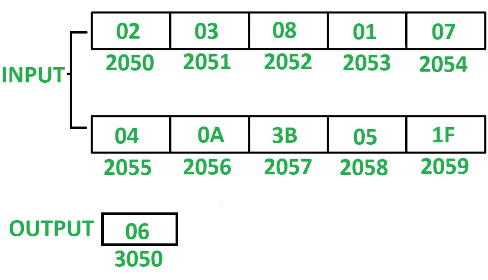

# 8085 程序计算 10 个数系列中的奇数总数

> 原文:[https://www . geesforgeks . org/8085-程序对计数-总数-奇数-10-数字系列/](https://www.geeksforgeeks.org/8085-program-to-count-total-odd-numbers-in-series-of-10-numbers/)

**程序–**在 8085 微处理器中编写汇编语言程序，对 10 个数串中的奇数进行计数。

**示例–**

**假设–**从起始存储位置 2050 开始存储 10 个 8 位数字。计数值存储在存储器位置 3050。

**算法–**

1.  用 20 初始化寄存器 H，用 4F 初始化寄存器 L，以便间接存储器指向存储单元 204F。
2.  用 00 初始化寄存器 C，用 0A 初始化寄存器 D。
3.  将间接内存增加 1。
4.  将 M 的值存储在累加器 a 中
5.  用 01 执行 A 的与运算，检查 A 中的内容是奇数还是偶数。
6.  如果在“与”运算后，A 的内容为 01，则扫描的数字为奇数，如果是，则 C 增加 01，否则，如果在“与”运算后，A 的内容为 00，则扫描的数字为偶数。递减 01。
7.  检查是否没有设置零标志，即 ZF = 0，然后跳转到步骤 3，否则在存储器位置 3050 存储 C 的值。

**程序–**

【跳跃 if ZF = 1】跳

| 存储地址 | 记忆术 | 评论 |
| 2000 | lxi h204 f | H < - 20，L < - 4F |
| 2003 | mvi c.00 | C < - 00 |
| 2005 | MVI D，0A | D < - 0A |
| 2007 | INX H | M < - M + 01 |
| 2008 | MOV A，M | A < - M |
| 2009 | ANI 01 | a<a(和) 01 |
|  | 【200 b】 | 【JZ 200 f】 | 如果 ZF = 0 |
| 【2013】 | 【mov a，C |

**说明–**寄存器 A、B、C、D、H、L 用于通用。

1.  **LXI H 204F:** 给 H 分配 20，给 l 分配 4F。
2.  **MVI C，00:** 给 C 分配 00
3.  **MVI D，0A:** 分配 0A 给 D
4.  **INX H:** 将间接内存位置 M 递增 01。
5.  **MOV A，M:** 将 M 的内容移动到 A
6.  **ANI 01:** 用 01 执行 A 的与运算，并将结果存储在 A 中
7.  **JZ 200F:** 如果 ZF = 1 跳转到内存位置 200F。
8.  **INR C:**C 递增 01。
9.  **DCR D:**D 递减 01。
10.  **JNZ 2007:** 如果 ZF = 0 跳转到内存位置 2007。
11.  **MOV A，C:** 将 C 的内容移到 A
12.  **STA 3050:** 将 A 的内容存储到存储器位置 3050。
13.  **HLT:** 停止执行程序并停止任何进一步的执行。