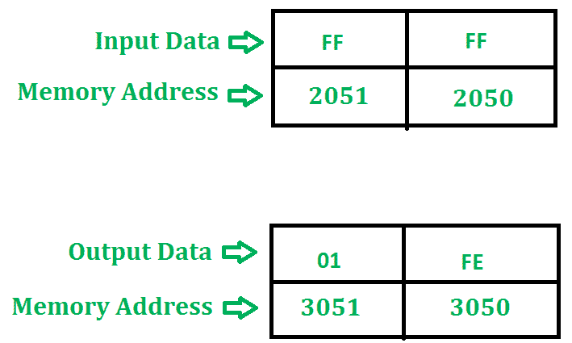

# 8085 程序划分两个 8 位数字

> 原文:[https://www . geesforgeks . org/8085-二进制 8 位数字除法/](https://www.geeksforgeeks.org/8085-program-to-divide-two-8-bit-numbers/)

**问题–**编写 8085 程序，对两个 8 位数字进行除法运算。

**示例–**

**算法–**

1.  通过加载带有存储单元地址的 HL 对寄存器来启动程序。
2.  将数据移到 B 寄存器。
3.  将第二个数据载入累加器。
4.  比较这两个数字来检查进位。
5.  减去两个数字。
6.  增加进位值。
7.  检查重复减法是否结束。
8.  然后将结果(商和余数)存储在给定的内存位置。
9.  终止程序。

**程序–**

<figure class="table">

| 地址 | 记忆术 | 评论 |
| --- | --- | --- |
| Two thousand | LXI H，2050 年 |   |
| Two thousand and three | 莫夫 b，m | B |
| Two thousand and four | MVI C， 00 | C |
| Two thousand and six | INX H(消歧义) |   |
| Two thousand and seven | 莫夫 a，m | A |
| Two thousand and eight | 《议定书》/《公约》缔约方会议 |   |
| Two thousand and nine | JC 2011 | 检查进位 |
| 200 摄氏度 | SUB B | A-B |
| 200D | INR C 中 | C |
| 200E | JMP 2008 |   |
| Two thousand and eleven | STA 3050 | 3050 |
| Two thousand and fourteen | 莫夫足球俱乐部 | A |
| Two thousand and fifteen | STA 3051 | 3051 |
| Two thousand and eighteen | HLT | 终止程序 |

**说明–**寄存器 A、H、L、C、B 用于通用。

1.  **LXI H，2050** 将用存储单元的地址 2050 加载 HL 对寄存器。

2.  **MOV B，M** 将内存内容复制到寄存器 B 中。

3.  **MVI C，00** 分配 00 给 C.

4.  **INX H** 递增寄存器对 HL。

5.  **MOV A，M** 将内存内容复制到累加器中。

6.  **CMP B** 比较累加器和寄存器 B 的内容

7.  **如果设置了进位标志，JC 2011** 跳转到地址 2011。

8.  **SUB B** 用寄存器 B 减去累加器的内容，并将结果存入累加器。

9.  **INR C** 增加寄存器 C

10.  **JMP 2008** 控制将转移到内存地址 2008。

11.  **STA 3050** 将剩余部分存储在存储器位置 3050。

12.  **MOV A，C** 将寄存器的内容复制到累加器中。

13.  **STA 3051** 将商存储在存储器位置 3051。

14.  **HLT** 停止执行程序，并停止任何进一步的执行。

</figure>