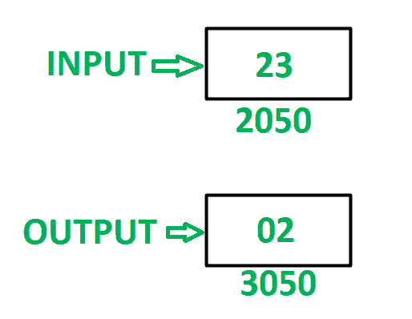

# 8085 程序以 8 位数的半字节执行“与”运算

> 原文:[https://www . geesforgeks . org/8085-8 位数字的半字节程序执行和操作/](https://www.geeksforgeeks.org/8085-program-to-perform-and-operation-in-nibbles-of-8-bit-number/)

**问题–**在 8085 微处理器中编写汇编语言程序，在 8 位数字的低位半字节和高位半字节之间执行**和**操作。

**示例–**

**假设–**8 位数字存储在存储器位置 2050。最终结果存储在存储器位置 3050。

**算法–**

1.  在 a 中加载内存位置 2050 的内容。
2.  对半字节进行屏蔽。将低位半字节存储在 B 中，高位半字节存储在 a 中
3.  借助 **ANA** 指令，执行 A 和 B 之间的“与”运算。
4.  将最终结果存储在存储单元 3050 中。

**程序–**

| 存储地址 | 记忆术 | 评论 |
| 2000 | LDA 2050 | A<-M【2050】 |
| 2003 | ANI 0F | A < - A(与)0F |
| 2005 | MOV B，A | B < - A |
| 2006 | LDA 2050 | A<-M【2050】 |
| 2009 | ANI F0 | A < - A(与)F0 |
| 200B | RLC | 将累加器向左旋转一位，不进位 |
| 200 摄氏度 | RLC | 将累加器向左旋转一位，不进位 |
| 200D | RLC | 将累加器向左旋转一位，不进位 |
| 200E | RLC | 将累加器向左旋转一位，不进位 |
| 200F | ANA B | A < - A(与)B |
| 2010 | 他们是 3050 | M【3050】<-A |
| 2013 | HLT | 结束 |

**说明–**寄存器 A、B 用于通用。

1.  **LDA 2050:** 将内存位置 2050 的内容加载到累加器 a 中。
2.  **ANI 0F:** 在 A 和 0F 中执行 AND 操作。将结果存储在 a 中。
3.  **MOV B，A:** 移动寄存器 B 中 A 的内容
4.  **LDA 2050:** 将内存位置 2050 的内容加载到累加器 a 中。
5.  **ANI F0:** 在 A 和 F0 中执行“与”运算。将结果存储在 a 中。
6.  **RLC:** 将 A 的内容向左旋转一位，不进位。使用此指令 4 次，反转 a 的内容。
7.  **ANA B:** 在 A 和 B 中执行 AND 运算，将结果存储在 A 中
8.  **STA 3050:** 将 A 的内容存储在存储单元 3050 中。
9.  **HLT:** 停止执行程序并停止任何进一步的执行。