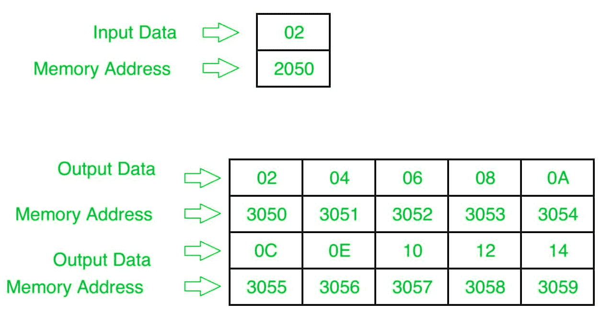

# 8085 程序打印输入整数的表格

> 原文:[https://www . geesforgeks . org/8085-程序打印输入整数表/](https://www.geeksforgeeks.org/8085-program-to-print-the-table-of-input-integer/)

**问题–**用 8085 编写汇编语言程序，打印输入整数的表格。

**假设–**假设输入的数字在存储位置 2050，表格将从起始位置 3050 打印。

**示例–**

**算法–**

1.  从存储单元 2050 加载累加器中的输入值，然后将其复制到另一个寄存器，比如 D。也将 0A 存储在寄存器 b 中
2.  使用 LXI 指令将存储单元 3050 存储在 M 中，并取另一个值为 00 的寄存器，比如 C。
3.  现在把 D 寄存器的内容复制到 A，加上 A 和 C 的内容，存储在 A，然后复制到 m。
4.  将 M 的值增加 1。
5.  将 A 的内容复制到 C，并将 B 的内容减 1，如果其值为 0，则暂停，否则再次转到步骤 3。

**程序–**

| 地址 | 记忆术 | 评论 |
| --- | --- | --- |
| Two thousand | LDA 2050 | 一 |
| Two thousand and three | 莫夫 d，a | D |
| Two thousand and four | MVI B 0A | B |
| Two thousand and six | LXI H 3050 战斗机 | H |
| Two thousand and nine | MVI C 00 | C |
| 200B | 莫夫 a，d | 一个 |
| 200 摄氏度 | 添加 C | 一个 |
| 200D | 莫夫 m，a | M |
| 200E | INX H(消歧义) | HL |
| 200F | 莫夫足球俱乐部 | C |
| Two thousand and ten | DCR B | B |
| Two thousand and eleven | JNZ 200B | 如果 ZF=0，跳转到地址 200B |
| Two thousand and fourteen | HLT | 终止程序 |

**解释–**

1.  **LDA 2050:** 将内容从 2050 内存位置加载到累加器(寄存器 A)。
2.  **MOV D，A:** 将累加器的内容移到寄存器 D
3.  **MVI B 0A:** 将 0A 数据存入寄存器 B
4.  **LXI H 3050:** 在 H 寄存器中存储 30，在 L 寄存器中存储 50，因此 M 将包含 3050。
5.  **MVI C 00:** 在寄存器 C 中存储 00 数据
6.  **MOV A，D:** 将 D 寄存器的内容移入 A
7.  **ADD C:** 将 A 和 C 寄存器的内容相加，存入 A。
8.  **MOV M，A:** 将 A 寄存器的内容移入 M
9.  **INX H:** 将 M 的含量增加 1。
10.  **MOV C，A:** 将 A 寄存器的内容移入 C
11.  **DCR B:** 将 B 寄存器的内容递减 1。
12.  **JNZ 200B:** 如果进位标志不为零，跳转到地址 200B。
13.  **HLT:** 终止程序。