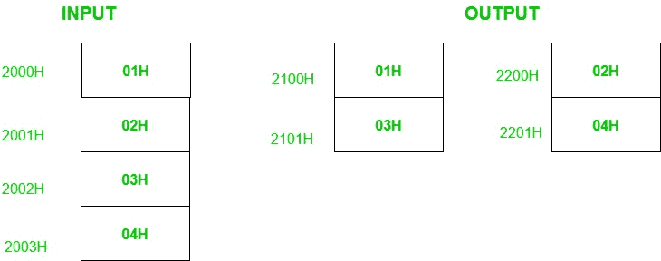

# 8085 从给定的数字列表中分离奇数和偶数编号的程序

> 原文:[https://www . geesforgeks . org/8085-程序从给定的数字列表中分离奇数和偶数编号/](https://www.geeksforgeeks.org/8085-program-to-separate-odd-and-even-nos-from-a-given-list-of-numbers/)

**问题:**在 8085 微处理器中编写汇编语言程序，从给定的 50 个数列表中分离出奇数和偶数。从内存位置 2100H 开始，将奇数编号存储在另一个列表中。从内存位置 2200H 开始，将偶数编号存储在另一个列表中。列表的起始地址是 2000H。

**示例:**

**解释:**
如果一个数的最低有效位为 1，则称该数为奇数，否则为偶数。因此，为了识别数字是偶数还是奇数，我们借助 ANI 指令对 01 进行与运算。如果这个数是奇数，那么我们将在累加器中得到 01 或 00。ANI 指令也会影响 8085 的标志。因此，如果累加器包含 00，则置零标志，否则复位。

**算法:**

1.  加载 HL 寄存器对中的存储单元 2000。
2.  加载存储奇数的 DE 寄存器对中的存储单元 2100。
3.  将元素数量存储在寄存器 c 中。
4.  将列表中的下一个数字移到累加器。
5.  用 01H 执行“与”运算，检查数字是偶数还是奇数。
6.  如果是偶数，跳到第 9 步。
7.  获取累加器中的数字，并存储在 DE 所指向的内存位置。
8.  增量 DE。
9.  增量 HL。减量 c。
10.  如果 C 不为零，跳到步骤 4。

对存储偶数执行类似的上述步骤。

**程序:**

| 存储单元 | 记忆术 | 评论 |
| --- | --- | --- |
| 2000 小时 | LXI H，2000 小时 | 初始化内存指针 1 |
| 2003H | LXI D，2100 小时 | 初始化内存指针 2 |
| 2006H | MVI C， 32H | 初始化计数器 |
| 2008H | 莫夫 a，m | 拿到号码 |
| 2009H | 0lH | 检查奇数 |
| 200BH | 南上 2011 | 如果是偶数，不要存储 |
| 200EH | 莫夫 a，m | 拿到号码 |
| 200FH | 斯塔 X D | 将数字存储在结果列表中 |
| 2010H | INX D(消歧义) | 增量指针 2 |
| 2011H | INX H(消歧义) | 增量指针 l |
| 2012H | DCR C(消歧义) | 减量计数器 |
| 2013H | jnz 2008 年 h | 如果不是零，重复 |
| 2016H | LXI H，2000 小时 | 初始化内存指针 l |
| 2019H | LXI D，2200 小时 | 初始化内存指针 2 |
| 201CH | MVI C， 32H | 初始化计数器 |
| 201EH | 莫夫 a，m | 拿到号码 |
| 201FH | 0lH | 检查偶数 |
| 2021H | jnz 2027 小时 | 如果是奇数，不要储存 |
| 2024 小时 | 莫夫 a，m | 拿到号码 |
| 2025H | 斯塔 X D | 将数字存储在结果列表中 |
| 2026H | INX D(消歧义) | 增量指针 2 |
| 2027H | INX H(消歧义) | 增量指针 l |
| 2028H | DCR C(消歧义) | 减量计数器 |
| 2029H | jnz 201 是吧 | 如果不是零，重复 |
| 202CH | HLT | 停止 |

