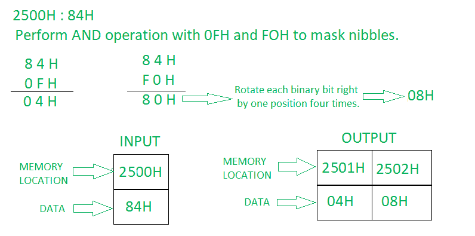

# 8085 程序将一个字节分成两个半字节

> 原文:[https://www . geesforgeks . org/8085-程序将一个字节分成两个半字节/](https://www.geeksforgeeks.org/8085-program-to-separate-or-split-a-byte-into-two-nibbles/)

**问题–**在 8085 微处理器中编写汇编语言程序，将一个字节拆分为两个半字节，并将结果存储在 2001H 和 2002H 中。
T3】示例–

**算法–**

1.  将内存位置 2500 的内容加载到累加器 a 中
2.  现在我们将对累加器和 OFH 的内容执行“与”运算。
3.  使用 STA，我们现在将结果存储在 2501H 存储位置。
4.  使用 LDA，我们将在累加器中加载 2500 小时的内容。
5.  再次执行“与”操作，将另一个半字节即“与”操作与累加器和 F0H 的内容分开。
6.  现在将累加器中的每个位向右旋转一个位置，并重复此步骤四次。
7.  现在使用 STA，我们将在 2502H 内存位置存储另一个半字节。

**程序–**

| 存储地址 | 记忆术 | 评论 |
| --- | --- | --- |
| Two thousand | LDA 2500H | A |
| Two thousand and three | 0FH 年 | A |
| Two thousand and five | 2501H | M[2501] |
| Two thousand and eight | LDA 2500H | A |
| 200B | 阿尼 F0H | A |
| 200D | （Ladyofthe）RoyalRedCross（英国）皇家护士红十字勋章（获得者） | 向右旋转一个位置 |
| 200E | （Ladyofthe）RoyalRedCross（英国）皇家护士红十字勋章（获得者） | 向右旋转一个位置 |
| 200F | （Ladyofthe）RoyalRedCross（英国）皇家护士红十字勋章（获得者） | 向右旋转一个位置 |
| Two thousand and ten | （Ladyofthe）RoyalRedCross（英国）皇家护士红十字勋章（获得者） | 向右旋转一个位置 |
| Two thousand and eleven | 2502 小时 | M[2502] |
| Two thousand and fourteen | HLT | 停止程序。 |

**解释–**
**RRC–**累加器的每个二进制位向右旋转一个位置。位 D0 被放置在 D7 的位置以及进位标志中。CY 根据位 D0 进行修改。

1.  **LDA 2500H–**加载累加器 A 中存储单元 2500 的内容。
2.  **ANI 0FH–**用蓄能器和 0FH 的内容物执行“与”操作。
3.  **STA 2501H–**将累加器的内容存储到存储器位置 2501H。
4.  **LDA 2500H–**加载累加器 A 中存储单元 2500 的内容。
5.  **ANI F0H–**用蓄能器和 F0H 的内容物执行“与”操作。
6.  **RRC–**将累加器中的每个位向右旋转一个位置。
7.  **RRC–**将累加器中的每个位向右旋转一个位置。
8.  **RRC–**将累加器中的每个位向右旋转一个位置。
9.  **RRC–**将累加器中的每个位向右旋转一个位置。
10.  **STA 2502H–**将累加器的内容存储到存储单元 2502h。
11.  **HLT–**停止程序执行。