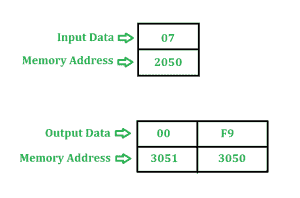
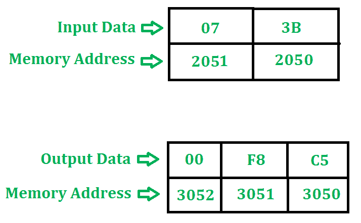

# 8085 用进位寻找 2 的补码的程序|集合 2

> 原文:[https://www . geesforgeks . org/8085-programs-to-find-2s-complement-with-carry-set-2/](https://www.geeksforgeeks.org/8085-programs-to-find-2s-compliment-with-carry-set-2/)

**问题-1:** 查找地址 2050 中存储的 8 位数字的 2 的补码。结果存储在地址 3050 和 3051。程序的起始地址取 2000。

**示例–**

**算法–**

1.  我们正在使用 **CMA** 指令取该数的补码。
2.  然后在结果上加上 01。
3.  添加 01 时生成的进位存储在 3051。

**程序–**

<figure class="table">

| 存储地址 | 记忆术 | 评论 |
| --- | --- | --- |
| Two thousand | LDA 2050 | a←2050 年 |
| Two thousand and three | 军事委员会(Committee of Military Affairs) | ←A 的补码 |
| Two thousand and four | INR 到 | 页:1 |
| Two thousand and five | 莫夫·l·a | L←A |
| Two thousand and six | MVI A 00 | 页:1 |
| Two thousand and eight | 模数转换器 | A←A+A+进位 |
| Two thousand and nine | 莫夫·h·a | 页:1 |
| 200A | SHLD 3050 突击步枪 | L→3050，H→3051 |
| 200D | HLT |   |

**解释–**使用的寄存器: **A、H、L**

1.  **LDA 2050** 加载 A 中 2050 的内容
2.  **CMA** 补充 A 的内容
3.  **INR A** 增加 A 01
4.  **MOV L，A** 复制 L 中 A 的内容
5.  **MVI A 00** 在 A 中移动 00
6.  **ADC A** 加 A、A、进位，赋给 A
7.  **MOV H，A** 复制 H 中 A 的内容
8.  **SHLD 3050** 在存储器位置 3051 存储 H 值，在 3050 存储 L 值
9.  **HLT** 停止执行程序并停止任何进一步的执行

**问题-2:** 查找存储在地址 2050 和 2051 的 16 位数字的 2 的补码。结果存储在地址 3050、3051 和 3052。程序的起始地址取 2000。

**示例–**

**算法–**

1.  我们使用 **CMA** 指令进行数字的补码。
2.  然后使用 **INX** 指令将 0001 添加到结果中。
3.  添加 0001 时生成的进位存储在 3052。

**程序–**

<figure class="table">

| 存储地址 | 记忆术 | 评论 |
| --- | --- | --- |
| Two thousand | LHLD 2050 年 | L←2050 年；h 85921 年 |
| Two thousand and three | 莫夫 a，l | 页:1 |
| Two thousand and four | 军事委员会(Committee of Military Affairs) | ←A 的补码 |
| Two thousand and five | 莫夫·l·a | L←A |
| Two thousand and six | 莫夫 a，h | 页:1 |
| Two thousand and seven | 军事委员会(Committee of Military Affairs) | ←的补码 |
| Two thousand and eight | 莫夫·h·a | 页:1 |
| Two thousand and nine | INX H(消歧义) | HL←HL+0001 |
| 200A | MVI A 00 | 页:1 |
| 200 摄氏度 | 模数转换器 | A←A+A+进位 |
| 200D | SHLD 3050 突击步枪 | L→3050，H→3051 |
| Two thousand and ten | STA 3052 | A→3052 |
| Two thousand and thirteen | HLT |   |

**解释–**使用的寄存器: **A、H、L**T4】

1.  **LHLD 2050** 加载 H 中的 2051 含量和 L 中的 2050 含量
2.  **MOV A，L** 复制 A 中 L 的内容
3.  **CMA** 补充 A 的内容
4.  **MOV L，A** 复制 L 中 A 的内容
5.  **MOV A，H** 复制 A 中 H 的内容
6.  **CMA** 补充 A 的内容
7.  **MOV H，A** 复制 H 中 A 的内容
8.  **INX H** 在 HL 中加 0001
9.  **MVI A 00** 在 A 中移动 00
10.  **ADC A** 将 A、A、进位相加，并将结果存储在 A 中
11.  **SHLD 3050** 在存储器位置 3051 存储 H 值，在 3050 存储 L 值
12.  **STA 3052** 在存储器位置 3052 存储 A 的值
13.  **HLT** 停止执行程序并停止任何进一步的执行

参考–[8085 程序查找 8 位数字的 1 和 2 补码](https://www.geeksforgeeks.org/8085-program-find-1s-2s-complement-8-bit-number/)
8085 程序查找 16 位数字的 1 和 2 补码

</figure>

</figure>