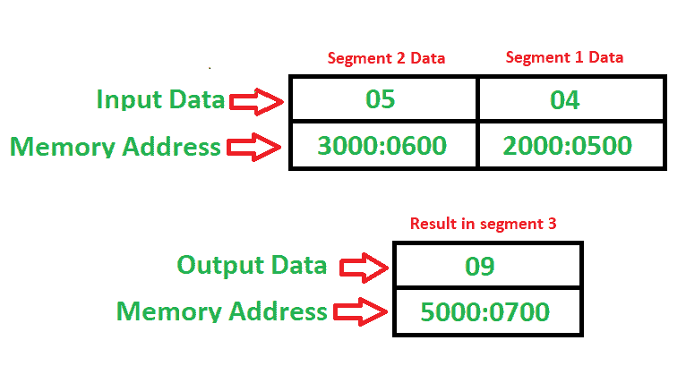

# 8086 程序将一个片段的内容添加到另一个片段

> 原文:[https://www . geesforgeks . org/8086-程序-添加-内容-一段-另一段/](https://www.geeksforgeeks.org/8086-program-add-content-one-segment-another-segment/)

**问题–**编写一个程序，将内存位置 **2000 : 0500** 的内容与内存位置 **3000 : 0600** 的内容相加，并将结果存入 **5000 : 0700** 内存位置。

**示例–**

**算法–**

1.  将 2000 年移入 CX 登记册
2.  将 CX 移动到 DS 细分市场(现在我们处于 2000 年数据细分市场)
3.  将值 500 移入 AX 寄存器
4.  将 3000 移入 CX 登记簿
5.  将 CX 移动到 DS 细分市场(现在我们处于 3000 数据细分市场)
6.  将 AX(累加器)的值与存储器 600 中的值相加
7.  将 5000 移入 CX 登记簿
8.  将 CX 移动到 ES 细分市场(现在我们在 5000 额外细分市场)
9.  将 AX 的内容移动到 700 内存位置
10.  停止

**程序–**

| 记忆 | 记忆术 | 操作数 | 评论 |
| --- | --- | --- | --- |
| One thousand | MOV | CX，2000 年 | [CX] |
| One thousand and four | MOV | DS， CX | [DS] |
| One thousand and six | MOV | AX，[500] | [AX] |
| 100A | MOV | CX，3000 | [CX] |
| 100E | MOV | DS， CX | [DS] |
| One thousand and ten | 注意缺陷障碍 (Attention Deficit Disorder) | AX，[600] | [AX] |
| One thousand and fourteen | MOV | CX，5000 | [CX] |
| One thousand and eighteen | MOV | 是的 CX | [是] |
| 101A | MOV | [700]，AX | [700] |
| 101E | HLT |  | 停止 |

**解释–**

寄存器使用 AX，CX 通用。
线段使用 DS、ES 来改变线段。
**【MOV】**用于传输数据
**用于添加**用于添加
**HLT** 用于暂停程序