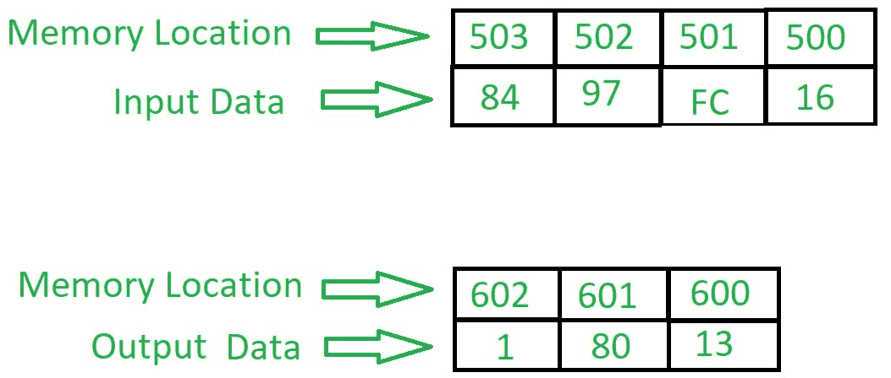

# 8086 程序添加两个带进位的 16 位 BCD 号

> 原文:[https://www . geesforgeks . org/8086-program-add-two-16 位-bcd-numbers-carry/](https://www.geeksforgeeks.org/8086-program-add-two-16-bit-bcd-numbers-carry/)

**问题–**编写一个汇编语言程序，在 8086 微处理器中用进位加两个 16 位 BCD 数。

**示例–**

**算法–**

1.  在不同位置加载两个 16 位 BCD 号的下部。
2.  将每个数字的下半部分相加。
3.  通过添加进位(如果有)重复上述步骤。
4.  将寄存器 00 的下部加上进位。这样做是为了获得进位。
5.  显示所有数字，最高部分为进位，中间部分为高 BCD 8 位的相加，低部分为低 BCD 8 位。

**程序–**

<figure class="table">

| 存储地址 | 记忆术 | 评论 |
| --- | --- | --- |
| 0400 | MOV AL，[500] | AL ← [500] |
| 0404 | MOV BL，[502] | BL ← [502] |
| 0408 | 添加人工智能、人工智能 | AL+BL |
| 040A | DAA | 十进制调整 |
| 040B | MOV [600]，第 1 段 | AL → [600] |
| 040F | MOV AL，[501] | 阿拉← [501] |
| 0413 | MOV BL，[503] | BL ← [503] |
| 0417 | ADC AL、BL | AL+BL+CY 组合键 |
| 0419 | DAA | 十进制调整 |
| 041A | MOV [601]，第 1 段 | AL → [601] |
| 041E | 莫夫·阿尔·00 | 上午 9 时 |
| 0420 | ADC AL，AL .阿拉伯联合酋长国 | 页:1 |
| 0422 | MOV [602]号文件 | 页:1 |
| 0426 | HLT | 停止执行 |

**解释–**

1.  **MOV a1、【500】**将存储在存储器位置 500 的值移动到 a1 寄存器。
2.  **MOV BL，[502]** 将存储在存储器位置 500 的值移动到 BL 寄存器。
3.  **添加 a1、BL** 将 a1 和 BL 寄存器中的值相加。
4.  **DAA** 在大于 9 的数字上加 6。
5.  **MOV【600】，a1**显示存储单元 600 的增加值。
6.  **MOV a1、【501】**将存储在存储器位置 501 的值移动到 a1 寄存器。
7.  **MOV BL，[503]** 将存储在存储器位置 503 的值移动到 BL 寄存器。
8.  **ADC a1、BL** 将 a1 和 BL 寄存器中的值相加并进位(如果有)。
9.  **MOV BL，[503]** 将存储在存储器位置 503 的值移动到 BL 寄存器。
10.  **MOV【601】，a1**显示存储单元 601 的增加值。
11.  **MOV a1，00** 在 a1 寄存器中移动 00。
12.  **模数转换器 A1、A1**将 A1 和 A1 寄存器中的值相加并进位(如果有)。
13.  **MOV【602】，a1**显示存储器位置 602 的增加值。
14.  **HLT** 停止执行。

下一篇相关文章–[8086 程序添加两个 8 位 BCD 号](https://www.geeksforgeeks.org/8086-program-add-two-8-bit-bcd-numbers/)

</figure>