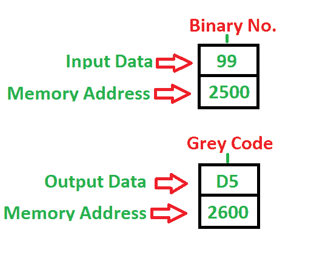

# 8086 程序将二进制转换为格雷码

> 原文:[https://www . geesforgeks . org/8086-program-convert-binary-grey-code/](https://www.geeksforgeeks.org/8086-program-convert-binary-grey-code/)

先决条件–[二进制至/自格雷码](https://www.geeksforgeeks.org/digital-logic-code-converters-binary-gray-code/)
**问题–**编写程序将二进制数转换为格雷码 8 位数，其中起始地址为 **2000** ，该数存储在 **2500** 内存地址，并将结果存储到 **2600** 内存地址。

**示例–**

**算法–**

1.  将[2500]处的值移入 a1
2.  将人工智能移入人工智能
3.  逻辑右移一次
4.  将 BL 与 a1 异或(逻辑上)并存储到 BL 中
5.  将 BL 的内容移入 2600
6.  停止

**程序–**

| 记忆 | 记忆术 | 操作数 | 评论 |
| --- | --- | --- | --- |
| Two thousand | MOV | AL，[2500] | [高] |
| Two thousand and four | MOV | 比尔，艾尔 | [BL] |
| Two thousand and six | share 分享 | 页:1 | 向右移动一次 |
| Two thousand and eight | 异或 | 比尔，艾尔 | [BL] |
| 200A | MOV | [2600]，BL | [2600] |
| 200E | HLT |  | 停止 |

**说明–**寄存器 a1、BL 用于通用目的

1.  **MOV** 用于传输数据
2.  **SHR** 用于向右(逻辑上)上移至计数器不为零
3.  **异或**用于两个值的异或(逻辑上)
4.  **HLT** 用于暂停程序

参见 [8085 将二进制数转换为灰色的程序](https://www.geeksforgeeks.org/8085-program-convert-binary-numbers-gray/)