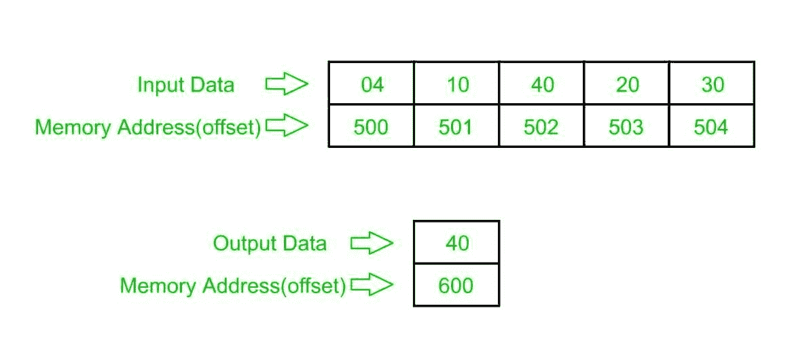

# 8086 程序确定 n 个数数组中最大的数

> 原文:[https://www . geesforgeks . org/8086-程序-确定-最大数-数组-n-numbers/](https://www.geeksforgeeks.org/8086-program-determine-largest-number-array-n-numbers/)

**问题–**在 8086 微处理器中编写程序，找出 8 位 n 个数字中最大的一个，其中大小“n”存储在内存地址 2000 : 500，数字从内存地址 2000 : 501 开始存储，并将结果(最大的数字)存储到内存地址 2000 : 600。

**示例–**

**算法–**

1.  将数据从偏移量 500 加载到寄存器 CL，并将寄存器 CH 设置为 00(用于计数)。
2.  从下一个偏移量(即 501)加载第一个数字(值)到寄存器 a1，并将计数减少 1。
3.  现在将寄存器 A1 的值与下一个偏移处的数据(值)进行比较，如果该数据大于寄存器 A1 的值，则将寄存器 A1 的值更新为该数据，否则不变，并增加下一次比较的偏移值，将计数减少 1，并继续这一过程，直到计数(寄存器 CX 的值)变为 0。
4.  将结果(寄存器 A1 的值)存储到内存地址 2000 : 600。

**程序–**

| 存储地址 | 记忆术 | 评论 |
| --- | --- | --- |
| four hundred | MOV 是，500 | 国际标准 |
| Four hundred and three | mov cl 是] | cl |
| Four hundred and five | 莫夫·契尔 | CH |
| Four hundred and seven | 国际公司 | SI |
| Four hundred and eight | MOV AL，[是] | al |
| 40A | DEC CL | CL |
| 40C | 国际公司 | SI |
| 40D | CMP AL，[是] | [是] |
| 40F | JNC 413 | 如果 CY=0，跳转到 413 |
| Four hundred and eleven | MOV AL，[是] | al |
| Four hundred and thirteen | 国际公司 | SI |
| Four hundred and fourteen | 步行 40D | CX |
| Four hundred and sixteen | MOV [600]，第 1 段 | al >[600] |
| 41A | HLT | 结束 |

**解释–**

1.  **MOV SI，500** :将 SI 的值设置为 500
2.  **MOV CL、【SI】**:从偏移 SI 加载数据到寄存器 CL
3.  **MOV 通道，00** :将寄存器通道的值设置为 00
4.  **INC SI**:SI 值增加 1。
5.  **MOV a1、【SI】**:从偏移 SI 到寄存器 a1 的加载值
6.  **DEC CL** :寄存器 CL 的值减 1
7.  **INC SI**:SI 值增加 1
8.  **CMP AL，[SI]** :比较寄存器 AL 和[SI]的值(AL-[SI])
9.  **JNC 413** :如果没有生成进位，跳转到地址 413
10.  **MOV a1、【SI】**:将偏移量 S1 处的数据传输到寄存器 a1
11.  **INC SI**:SI 值增加 1
12.  **LOOP 40C** :将寄存器 CX 的值减少 1，如果寄存器 CX 的值不为零，则跳转到地址 40D
13.  **MOV【600】，a1**:将寄存器 a1 的值存储到偏移 600
14.  **HLT** :停止