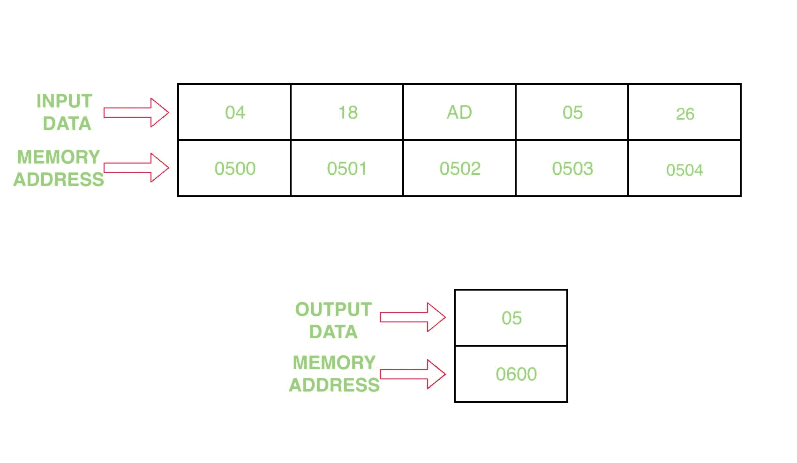

# 8086 程序寻找给定数组中的最小值

> 原文:[https://www . geesforgeks . org/8086-program-find-min-value-given-array/](https://www.geeksforgeeks.org/8086-program-find-min-value-given-array/)

**问题–**编写一个程序，在汇编 8086 微处理器中找到给定数组的最小值

**示例–**

**假设–**输入数组的起始地址为 0500，并将结果存储在地址 0600

**算法–**

1.  在国际单位制中赋值 500，在直接投资中赋值 600
2.  在 CL 中移动[SI]的内容，并将 SI 增加 1
3.  将值 00 H 分配给 CH
4.  移动人工智能中[人工智能]的内容
5.  将 CX 值减少 1
6.  将 SI 值增加 1
7.  在 BL 中移动[SI]的内容
8.  比较 BL 和 AL 的值
9.  如果进位标志被设置，跳到步骤 11
10.  在人工智能中移动基本层的内容
11.  跳到步骤 6，直到 CX 的值变为 0，并将 CX 减少 1
12.  在[DI]中移动人工智能的内容
13.  暂停程序

**程序–**

| 存储地址 | 记忆术 | 评论 |
| --- | --- | --- |
| 0400 | MOV 是，500 | 国际标准 |
| 0403 | MOV，600 磅 | DI |
| 0406 | mov cl 是] | cl |
| 0408 | 莫夫·契尔 | CH |
| 040A | 国际公司 | SI |
| 040B | MOV AL，[是] | al |
| 040D | DEC CX | CX |
| 040E | 国际公司 | SI |
| 040F | mov bl 是] | BL |
| 0411 | CMP AL、BL | 阿尔-BL |
| 0413 | JC 0417 | 进位为 1 时跳转 |
| 0415 | 莫夫·艾尔，BL | 艾尔 |
| 0417 | 回路 040E | 如果 CX 不等于 0，则跳转 |
| 0419 | MOV [DI]，AL | [发件人] |
| 041B | HLT | 节目结束 |

**解释–**

1.  MOV 国际标准，500 指定 500 给国际标准
2.  MOV DI，600 分配 600 给 DI
3.  MOV CL，[SI]将[SI]的内容移动到 CL 寄存器
4.  MOV 通道，00 将 00 分配给通道寄存器
5.  将值 SI 增加 1
6.  MOV AL，[SI]将[SI]的内容移动到 AL 寄存器
7.  DEC CX 将 CX 登记册的内容减少 1
8.  将值 SI 增加 1
9.  MOV BL，[SI]将[SI]的内容移动到 BL 寄存器
10.  化学机械抛光 a1、B1 从 a1 中减去 B1 寄存器的值，并修改标志寄存器
11.  如果进位标志被设置，JC 0417 跳转到 0417 地址
12.  MOV 人工智能，人工智能将人工智能寄存器的内容移到人工智能寄存器
13.  LOOP 040E 运行循环，直到 CX 不等于零，并将 CX 值减少 1
14.  MOV [DI]，人工智能将人工智能的内容移动到[DI]
15.  HLT 停止程序的执行