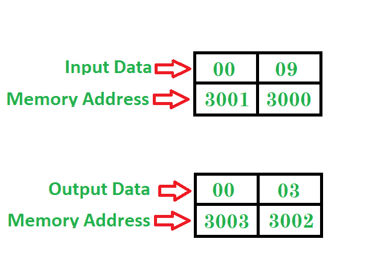

# 8086 程序求一个完美平方根数的平方根| Set-2

> 原文:[https://www . geesforgeks . org/8086-program-find-平方根-perfect-平方根-number-set-2/](https://www.geeksforgeeks.org/8086-program-find-square-root-perfect-square-root-number-set-2/)

先决条件–[8086 求一个数的平方根的程序](https://www.geeksforgeeks.org/8086-program-find-square-root-number/)
**问题–**编写一个求一个完全数的平方根的程序，其中代码的起始地址为 **2000** ，数存储在 **3000** 内存地址，并将结果存储到 **3002** 内存地址。

**示例–**

**算法–**

1.  移动 0000 立即注册 CX
2.  将存储器 3000 的值移入 BX 寄存器
3.  将 CX 移至 AX
4.  累加器值与 CX 相乘
5.  将 AX 与 BX 进行比较
6.  从零跳到一步
7.  将 CX 登记册增加 1
8.  如果没有零，跳到步骤 3
9.  将 CX 寄存器的内容移入存储器 3002
10.  停止

**程序–**

| 记忆 | 记忆术 | 操作数 | 评论 |
| --- | --- | --- | --- |
| Two thousand | MOV | CX，0000 | [CX] |
| Two thousand and three | MOV | BX[3000] | [BX] |
| Two thousand and seven | MOV | AX， CX | [AX] |
| Two thousand and nine | MUL | CX | [AX] |
| 200B | 金属波纹管(Corrugated Metal Pipe) | AX， BX | [AX] - [BX] |
| 200D | JZ | Two thousand and fifteen | 零跳 |
| Two thousand and ten | 股份有限公司 | CX | [客户体验] |
| Two thousand and twelve | JNZ | Two thousand and seven | 如果不为零，则跳转 |
| Two thousand and fifteen | MOV | [3002]，CX | [3002] |
| Two thousand and nineteen | HLT |  | 停止 |

**说明–**寄存器 AX，BX，CX，用于通用。

1.  **MOV** 用于传输数据
2.  **INC** 用于给定寄存器增加 1
3.  **JNZ** 用于在它们的不为零时跳转到给定的步骤
4.  **如果它们的值为零，JZ** 用于跳转到给定的步骤
5.  **MUL** 用于将 AX 值与给定寄存器相乘
6.  **CMP** 用于比较两个寄存器的值
7.  **HLT** 用于暂停程序