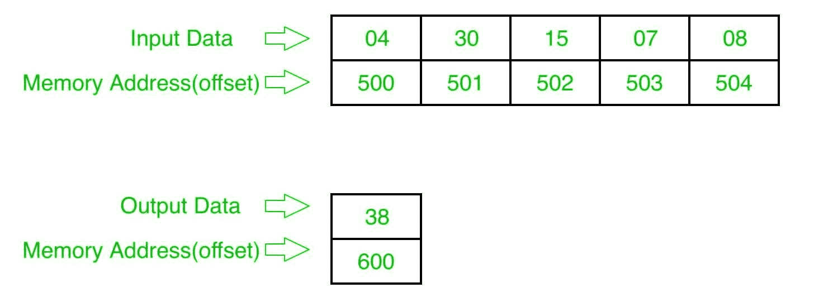

# 8086 程序求给定数列中偶数的和

> 原文:[https://www . geesforgeks . org/8086-program-find-sum-偶数-给定-数列/](https://www.geeksforgeeks.org/8086-program-find-sum-even-numbers-given-series/)

**问题–**在 8086 微处理器中编写一个程序，找出偶数系列的和，其中数字从起始偏移量 500 开始存储，结果存储在偏移量 600。

**示例–**

**算法–**

1.  给国际单位制分配 500
2.  将数据从偏移 SI 加载到寄存器 CL(计数)，并将 00 分配给寄存器 CH Inc . SI 1
3.  从偏移 SI 加载数据，并用 01 进行测试，如果结果为非零，跳到步骤 5
4.  用寄存器 a1 添加偏移数据
5.  将偏移量增加 1
6.  循环至步骤 3
7.  将结果(寄存器 a1 的内容)存储到偏移量 600
8.  停止

**程序–**

| 存储地址 | 记忆术 | 评论 |
| --- | --- | --- |
| four hundred | MOV 是，500 | 国际标准 |
| Four hundred and three | mov cl 是] | cl |
| Four hundred and five | 国际公司 | SI |
| Four hundred and six | 莫夫·契尔 | CH |
| Four hundred and eight | 莫夫·阿尔·00 | -00 点 |
| 40A | mov bl 是] | BL |
| 40C | 测试 BL，01 | BL 和 01 |
| 40F | JNZ 413 | 如果不是零就跳 |
| Four hundred and eleven | 添加人工智能、人工智能 | AL |
| Four hundred and thirteen | 国际公司 | SI |
| Four hundred and fourteen | LOOP 40A | 如果 CX 不是零，跳到 40A |
| Four hundred and sixteen | MOV [600]，第 1 段 | al >[600] |
| 41A | HLT | 结束 |

**解释–**

1.  **MOV SI，500:** 给 SI 分配 500
2.  **MOV CL、【SI】:**从偏移 SI 向寄存器 CL 加载数据
3.  **INC SI:**SI 值增加 1
4.  **MOV 通道，00:** 分配 00 到寄存器通道
5.  **MOV a1，00:** 分配 00 到注册 a1
6.  **MOV BL、【SI】:**从偏移 SI 向寄存器 BL 加载数据
7.  **测试 BL，01:** 并用 01 注册 BL
8.  **JNZ 413:** 如果不为零，跳转到地址 413
9.  **添加 a1、BL:** 添加寄存器 a1 和 BL 的内容
10.  **INC SI:**SI 值增加 1
11.  **LOOP 40A:** 如果 CX 不为零，CX=CX-1，跳转到 40A
12.  **MOV [600]，a1:**将寄存器 a1 的值存储到偏移 600
13.  **HLT:** 结束。

参考–[8086 程序寻找给定序列中奇数的和](https://www.geeksforgeeks.org/8086-program-find-sum-odd-numbers-given-series/)