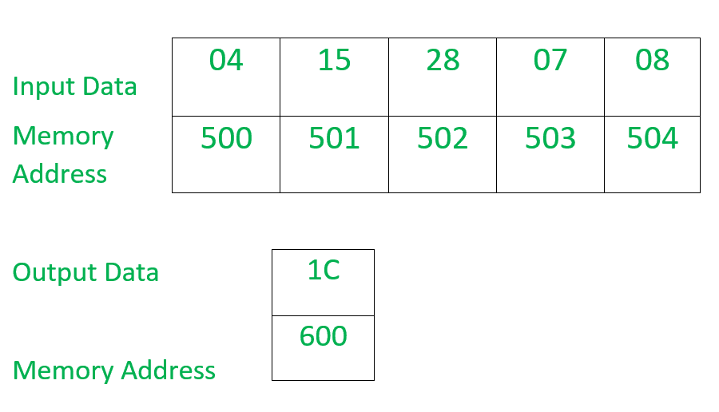

# 8086 程序求给定数列中奇数的和

> 原文:[https://www . geesforgeks . org/8086-program-find-sum-奇数-给定-数列/](https://www.geeksforgeeks.org/8086-program-find-sum-odd-numbers-given-series/)

**问题–**编写一个汇编语言程序，找出包含存储在连续存储单元中的 8 位数字的给定序列中奇数的和，并将结果存储在另一个存储单元中。

**示例–**



**示例说明–**

1.  500 offset 存储序列的计数器值，序列的元素从 501 到 504 offset 开始。
2.  在这个例子中，我们只有 4 个术语。将 a1 寄存器中的奇数项(在 BL 寄存器中找到)15+07 相加，结果存储(1C)在 a1 寄存器中。
3.  a1 寄存器的结果以 600°偏移存储。

**假设–**

1.  指示序列中有多少个数字的计数器值存储在存储单元 500 中。
2.  系列的元素存储在从 501 开始的连续存储位置。
3.  结果存储在存储器位置 600。
4.  程序的起始地址是 400。

**测试–**

```
Syntax: TEST d, s 
```

它执行目的地和源的“与”运算，但结果不被存储，只有标志被修改。

**算法–**

1.  将数据从偏移量 500 加载到寄存器 C1。
2.  增加偏移量的值。
3.  将 00H 载入通道寄存器。
4.  将 00H 载入 AL 寄存器。
5.  将数据从偏移量加载到寄存器 BL。
6.  使用测试指令检查 BL 中的数据是偶数还是奇数，如果设置了零标志，则表示数据是偶数，然后转到步骤 7，否则数据是奇数，然后转到步骤 8。
7.  跳转到内存位置 413H。
8.  将 a1 和 BL 寄存器的数据相加，并将结果存储在 a1 寄存器中。
9.  增加偏移量的值。
10.  如果 CX 的内容不等于零，跳到存储位置 40AH，否则转到步骤 11。
11.  将数据从 a1 寄存器加载到存储单元 600。
12.  结束

**程序–**

<figure class="table">

| 地址 | 记忆术 | 评论 |
| --- | --- | --- |
| four hundred | MOV 是，500 | 国际标准 |
| Four hundred and three | mov cl 是] | cl |
| Four hundred and five | 国际公司 | SI |
| Four hundred and six | 莫夫·契尔 | CH |
| Four hundred and eight | 莫夫·阿尔·00 | -00 点 |
| 40A | mov bl 是] | BL |
| 40C | 测试 BL，01 | BL.01 |
| 40F | JZ 413 | 如果设置了零标志，跳转到 413 存储单元 |
| Four hundred and eleven | 添加人工智能、人工智能 | AL |
| Four hundred and thirteen | 国际公司 | SI |
| Four hundred and fourteen | LOOP 40A | 如果 CX 的内容不等于零，跳转到 40A 存储位置 |
| Four hundred and sixteen | MOV [600]，第 1 段 | 页:1 |
| 41A | HLT | 结束 |

**解释–**

1.  **MOV SI，500** 将值 500 加载到 SI。
2.  **MOV CL、【SI】**将偏移 SI 的数据载入 CL 寄存器。
3.  **INC SI** 将 SI 的值增加 1。
4.  **MOV 通道，00** 将值 00 载入通道寄存器。
5.  **MOV A1，00** 将值 00 载入 A1 寄存器。
6.  **MOV BL、【SI】**将偏移 SI 的数据载入 BL 寄存器。
7.  **测试 BL，01** 和 BL 的内容以及值 01 和标志寄存器的操作被修改。
8.  **如果设置了零标志，JZ 413** 跳转到 413 存储位置。
9.  **添加 a1、BL** 将 a1、BL 寄存器的内容相加，并将结果存入 a1 寄存器。
10.  **INC SI** 将 SI 的值增加 1。
11.  **如果 CX 值不等于零，则循环 40A** 跳到 40A 存储位置。
12.  **MOV【600】，a1**将 a1 寄存器的内容加载到存储单元 600。
13.  **HLT** 停止程序的执行。

</figure>