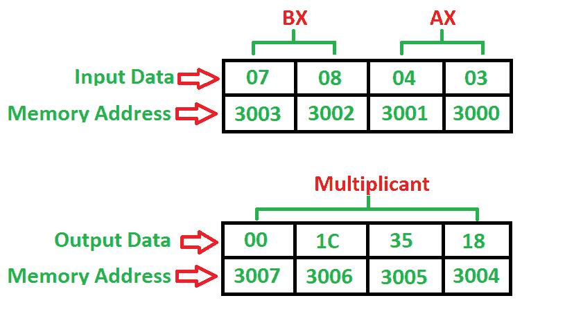

# 8086 程序将两个 16 位数字相乘

> 原文:[https://www . geesforgeks . org/8086-program-multiple-two-16 位数字/](https://www.geeksforgeeks.org/8086-program-multiply-two-16-bit-numbers/)

**问题–**编写一个程序，将两个 16 位数字相乘，起始地址为 **2000** ，数字位于 **3000** 和 **3002** 内存地址，并将结果存储到 **3004** 和 **3006** 内存地址中。

**示例–**

**算法–**

1.  首先将数据从存储器 3000 载入 AX(累加器)
2.  将数据从存储器 3002 载入 BX 寄存器
3.  用累加器 AX 乘 BX
4.  将数据从 AX(累加器)移动到内存
5.  将数据从 DX 移动到 AX
6.  将数据从 AX(累加器)移动到内存
7.  停止

**程序–**

| 记忆 | 记忆术 | 操作数 | 评论 |
| --- | --- | --- | --- |
| Two thousand | MOV | AX，[3000] | [AX] |
| Two thousand and four | MOV | BX，[3002] | [BX] |
| Two thousand and eight | MUL | 布朗克斯(Bronx) | [AX] |
| 200A | MOV | [3004]，AX | [3004] |
| 200E | MOV | AX、DX | [AX] |
| Two thousand and ten | MOV | [3006]，AX | [3006] |
| Two thousand and fourteen | HLT |  | 停止 |

**解释–**

1.  **MOV** 用于加载和存储数据。
2.  **MUL** 用于乘以两个 16 位数字。
3.  **HLT** 用于停止程序。
4.  **AX** 是一个累加器，用于存储结果。
5.  **BX，DX** 是通用寄存器，其中 BX 用于乘法，DX 用于结果。