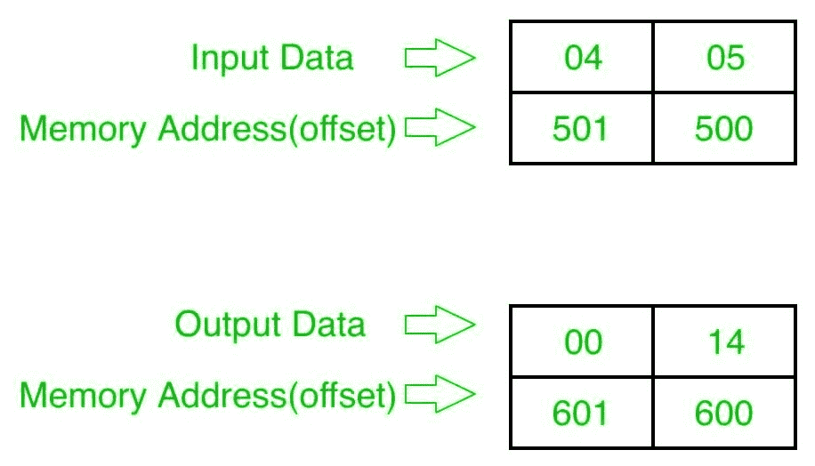

# 8086 程序将两个 8 位数字相乘

> 原文:[https://www . geesforgeks . org/8086-program-multiple-two-8 位数字/](https://www.geeksforgeeks.org/8086-program-multiply-two-8-bit-numbers/)

**问题–**在 8086 微处理器中编写一个程序，将两个 8 位数字相乘，其中数字从偏移量 500 开始存储，并将结果存储到偏移量 600 中。

**示例–**输入和输出以十六进制表示。

**算法–**

1.  将数据从偏移量 500 加载到寄存器 a1(第一个数字)
2.  将数据从偏移量 501 加载到寄存器 BL(第二个数)
3.  将它们相乘(AX=AL*BL)
4.  将结果(寄存器 AX 的内容)存储到偏移量 600
5.  停止

**程序–**

| 存储地址 | 记忆术 | 评论 |
| --- | --- | --- |
| four hundred | MOV 是，500 | 国际单位制=500 |
| Four hundred and three | MOV，600 磅 | DI=600 |
| Four hundred and six | MOV AL，[是] | al |
| Four hundred and eight | 国际公司 | SI=SI+1 |
| Four hundred and nine | mov bl 是] | BL |
| 40B | 穆尔 BL | AX=AL*BL |
| 40D | MOV [DI]，AX | ax >[来源] |
| 40F | HLT | 结束 |

**解释–**

1.  **MOV 国际标准，500** 将 500 设置为国际标准
2.  **MOV DI，600** 将 600 设置为 DI
3.  **MOV 寄存器 A1、【S1】**将偏移 S1 的内容加载到寄存器 A1
4.  **INC SI** 将 SI 值增加 1
5.  **MOV BL、【SI】**将偏移 SI 的内容加载到寄存器 BL
6.  **MUL BL** 将寄存器 a1 和 BL 的内容相乘
7.  **MOV [DI]，AX** 存储结果(寄存器 AX 的内容)以偏移 DI
8.  **HLT** 结束。