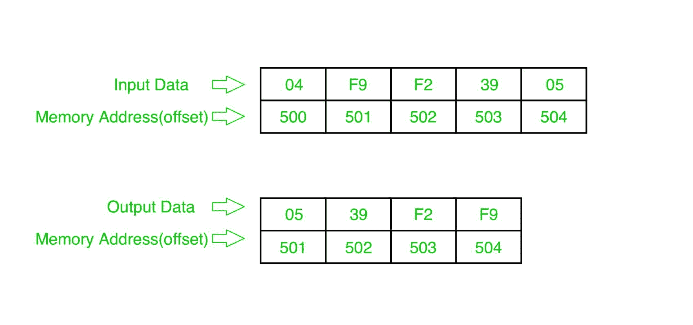

# 8086 程序对整数数组进行升序排序

> 原文:[https://www . geesforgeks . org/8086-程序-排序-整数-数组-升序/](https://www.geeksforgeeks.org/8086-program-sort-integer-array-ascending/)

**问题–**在 8086 微处理器中编写一个程序，对 n 个数字的数组中的数字进行升序排序，其中大小“n”存储在内存地址 2000 : 500，数字从内存地址 2000 : 501 开始存储。

**示例–**



示例说明:

```
Pass-1: 
F9 F2 39 05
F2 F9 39 05
F2 39 F9 05
F2 39 05 F9 (1 number got fix)

Pass-2: 
F2 39 05 F9
39 F2 05 F9
39 05 F2 F9 (2 number got fix)

Pass-3: 
39 05 F2 F9
05 39 F2 F9 (sorted)
```

**算法–**

1.  将数据从偏移量 500 加载到寄存器 C1(用于计数)。

2.  从起始内存位置移动到最后，如果第一个数字大于第二个数字，比较两个数字，然后交换它们。

3.  第一遍确定最后一个数字的位置。

4.  将计数减少 1。

5.  再次从起始存储位置移动到(倒数第一，借助计数)并比较两个数字，如果第一个数字大于第二个数字，则交换它们。

6.  第二遍确定最后两个数字的位置。

7.  重复。

**程序–**

<figure class="table">

| 存储地址 | 记忆术 | 评论 |
| --- | --- | --- |
| four hundred | MOV 是，500 | 国际标准 |
| Four hundred and three | mov cl 是] | cl |
| Four hundred and five | DEC CL | CL |
| Four hundred and seven | MOV 是，500 | 国际标准 |
| 40A | mov ch 是] | ch |
| 40C | DEC CH | CH |
| 40E | 国际公司 | SI |
| 40F | MOV AL，[是] | al |
| Four hundred and eleven | 国际公司 | SI |
| Four hundred and twelve | CMP AL，[是] | [是] |
| Four hundred and fourteen | JC 41C | 如果 CY=1，跳到 41C |
| Four hundred and sixteen | XCHG AL，[是] | 互换铝和硅 |
| Four hundred and eighteen | DEC SI | SI |
| Four hundred and nineteen | XCHG AL，[是] | 互换铝和硅 |
| 41B | 国际公司 | SI |
| 41C | DEC CH | CH |
| 41E | JNZ 40F 足球俱乐部 | 如果 ZF=0，跳到 40 华氏度 |
| Four hundred and twenty | DEC CL | CL |
| Four hundred and twenty-two | JNZ 407 | 如果 ZF=0，跳到 407 |
| Four hundred and twenty-four | HLT | 结束 |

**解释–**

1.  **MOV SI, 500**: set the value of SI to 500.
2.  **MOV CL, [SI]**: load data from offset SI to register CL.
3.  **DEC CL**: decrease value of register CL BY 1.
4.  **MOV SI, 500**: set the value of SI to 500.
5.  **MOV CH, [SI]**: load data from offset SI to register CH.
6.  **DEC CH**: decrease value of register CH BY 1.
7.  **INC SI**: increase value of SI BY 1.
8.  **MOV a1、【SI】**:从偏移 SI 到寄存器 a1 的加载值。

9.  **INC SI**: increase value of SI BY 1.
10.  **CMP AL、【SI】**:比较寄存器 AL 和【SI】的值(AL-[SI])。

11.  **JC 41C** :如果生成进位，跳转到地址 41C。

12.  **XCHG AL、【SI】**:交换寄存器 AL 和 SI 的内容。

13.  **DEC SI**:SI 值减 1。

14.  **XCHG AL、【SI】**:交换寄存器 AL 和 SI 的内容。

15.  **INC SI**:SI 值增加 1。

16.  **DEC CH** :寄存器 CH 的值减 1。

17.  **JNZ 40F** :如果零平复位，跳转到地址 40F。

18.  **DEC CL** :寄存器 CL 的值减 1。

19.  **JNZ 407** :如果零平复位，跳转到地址 407。

20.  **HLT** :停止。

</figure>