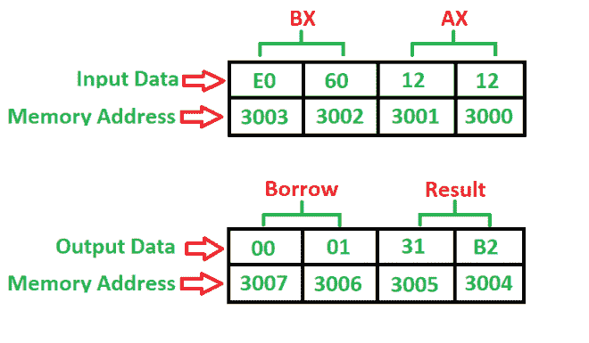

# 8086 程序减去两个 16 位数字有无借用

> 原文:[https://www . geesforgeks . org/8086-程序-减二-16 位数字-不借/](https://www.geeksforgeeks.org/8086-program-subtract-two-16-bit-numbers-without-borrow/)

**问题–**写一个程序减去两个 16 位数字，起始地址为 **2000** ，数字位于 **3000** 和 **3002** 内存地址，并将结果存入 **3004** 和 **3006** 内存地址。

**示例–**

**算法–**

1.  将 0000 小时载入 CX 登记簿(借)
2.  将数据从存储器 3000 加载到 AX(累加器)中
3.  将数据从存储器 3002 载入 BX 寄存器
4.  用累加器 AX 减去 BX
5.  不借就跳
6.  将 CX 增加 1
7.  将数据从 AX(累加器)移动到内存 3004
8.  将数据从 CX 寄存器移动到存储器 3006
9.  停止

**程序–**

| 记忆 | 记忆术 | 操作数 | 评论 |
| --- | --- | --- | --- |
| Two thousand | MOV | CX，0000 | [CX] |
| Two thousand and three | MOV | AX，[3000] | [AX] |
| Two thousand and seven | MOV | BX，[3002] | [BX] |
| 200B | 潜水艇 | AX， BX | [AX] |
| 200D | JNC | Two thousand and ten | 不借就跳 |
| 200F | 股份有限公司 | CX | [客户体验] |
| Two thousand and ten | MOV | [3004]，AX | [3004] |
| Two thousand and fourteen | MOV | [3006]，CX | [3006] |
| Two thousand and eighteen | HLT |  | 停止 |

**解释–**

1.  **MOV** 用于加载和存储数据。
2.  **SUB** 用于减去两个数字，其中一个数字是否在累加器中。
3.  **JNC** 是一个 2 位命令，用于检查借入是否由累加器产生。
4.  **INC** 用于将寄存器增加 1。
5.  **HLT** 用于停止程序。
6.  **AX** 是一个累加器，用于加载和存储数据。
7.  **CX BX**是通用寄存器，其中 BX 用于存储第二个数字，CX 用于存储借位。