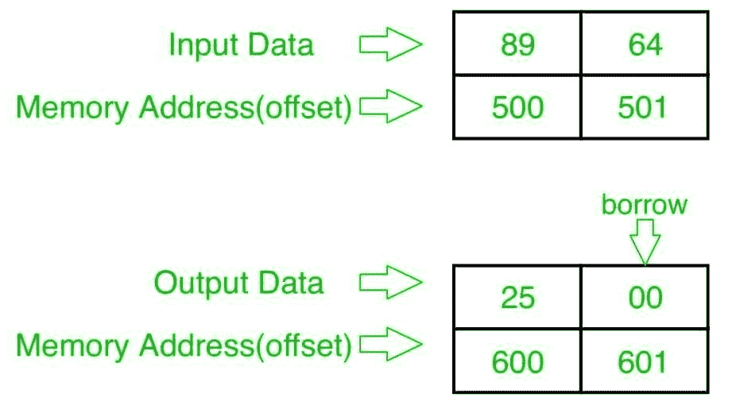

# 8086 程序减去两个 8 位 BCD 号

> 原文:[https://www . geesforgeks . org/8086-program-减法-二-8 位-bcd-numbers/](https://www.geeksforgeeks.org/8086-program-subtract-two-8-bit-bcd-numbers/)

**问题–**在 8086 微处理器中编写一个程序，找出两个 8 位 BCD 数的减法，从起始内存地址 2000 : 500 开始存储，结果存储到内存地址 2000 : 600，在 2000 : 601 进行进位(借位)。

**示例–**

**算法–**

1.  将数据从偏移量 500 加载到寄存器 a1(第一个数字)
2.  将数据从偏移量 501 加载到寄存器 BL(第二个数)
3.  减去这两个数字(寄存器 a1 和寄存器 BL 的内容)
4.  应用 DAS 指令(十进制调整)
5.  将结果(寄存器 a1 的内容)存储到偏移量 600
6.  将寄存器 A1 设置为 00
7.  用进位(借用)将寄存器 a1 的内容添加到自身
8.  将结果(寄存器 a1 的内容)存储到偏移量 601
9.  停止

**程序–**

| 存储地址 | 记忆术 | 评论 |
| --- | --- | --- |
| four hundred | MOV AL，[500] | AL |
| Four hundred and four | MOV BL，[501] | BL |
| Four hundred and eight | SUB AL， BL | AL |
| 40A | 这是什么 | 十进制调整铝 |
| 40B | MOV [600]，第 1 段 | al >[600] |
| 40F | 莫夫·阿尔·00 | -00 点 |
| Four hundred and eleven | ADC AL，AL .阿拉伯联合酋长国 | al+al+cy(预测) |
| Four hundred and thirteen | MOV [601]，第 1 段 | al >[601] |
| Four hundred and seventeen | HLT | 结束 |

**解释–**

1.  **MOV 寄存器 A1、【500】**从偏移量 500 加载数据到寄存器 A1。
2.  **MOV BL，【501】**从偏移量 501 加载数据到寄存器 BL。
3.  **SUB a1，BL** 减去寄存器 a1 和 BL 的内容。
4.  **DAS** 小数调整 al。
5.  **MOV【600】，a1**存储从寄存器 a1 到偏移 600 的数据。
6.  **MOV A1，00** 将寄存器 A1 的值设置为 00。
7.  **模数转换器 A1、A1**通过借用将寄存器 A1 的内容添加到 A1。
8.  **MOV【601】，a1**存储从寄存器 a1 到偏移 601 的数据。
9.  **HLT** 结束。