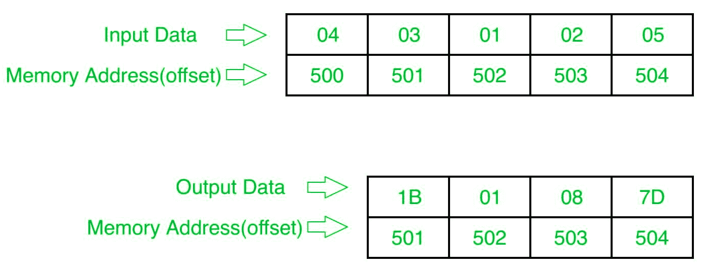

# 8086 确定 n 个数字数组中的数字立方体的程序

> 原文:[https://www . geesforgeks . org/8086-程序确定数字数组中的数字立方体/](https://www.geeksforgeeks.org/8086-program-to-determine-cubes-of-numbers-in-an-array-of-n-numbers/)

**问题–**在 8086 微处理器中编写一个程序，找出 8 位 n 个数的立方，其中大小“n”存储在偏移量 500 处，个数从偏移量 501 开始存储，并将结果数存储到偏移量 501 中。(假设立方体的长度限制为 8 位)。

**示例–**

**算法–**

1.  将 500 存储到 SI，并将偏移量 500 的数据加载到寄存器 CL，并将寄存器 CH 设置为 00(用于计数)。
2.  将 SI 值增加 1。
3.  从偏移 SI 到寄存器 a1 的加载编号(值)。
4.  将寄存器 A1 的值移到 BL。
5.  将寄存器 A1 中的值乘以自身。
6.  将寄存器 A1 中的值乘以 BL。
7.  将结果(寄存器 A1 的值)存储到存储器偏移 SI。
8.  将 SI 值增加 1。
9.  循环到 6 以上，直到 CX 寄存器为 0。

**程序–**

| 存储地址 | 记忆术 | 评论 |
| --- | --- | --- |
| four hundred | MOV 是，500 | 国际标准 |
| Four hundred and three | mov cl 是] | cl |
| Four hundred and five | 莫夫·契尔 | CH |
| Four hundred and seven | 国际公司 | SI |
| Four hundred and eight | MOV AL，[是] | al |
| 40A | 莫夫·bl，阿尔 | bl |
| 40C | 穆尔阿尔 | ax=al * |
| 40E | 穆尔 BL | AX=AL*BL |
| Four hundred and ten | mov[是]，AL | al >[是] |
| Four hundred and twelve | 国际公司 | SI |
| Four hundred and thirteen | 回路 408 | 跳到 408 IF CX！=0，CX=CX-1 |
| Four hundred and fifteen | HLT | 结束 |

**解释–**

1.  **MOV SI，500:** 将 SI 的值设置为 500
2.  **MOV CL、【SI】:**从偏移 SI 向寄存器 CL 加载数据
3.  **MOV 通道，00:** 将寄存器通道的值设置为 00
4.  **INC SI:**SI 值增加 1。
5.  **MOV a1、【SI】:**从偏移 SI 到寄存器 a1 的加载值
6.  **MOV B1、a1:**将寄存器 a1 的值移动到 B1。
7.  **MUL a1:**寄存器 a1 的值乘以 a1。
8.  **MUL BL:** 寄存器 a1 的值乘以 BL。
9.  **MOV[S1]，A1:**存储偏移量 S1 处寄存器 A1 的值。
10.  **INC SI:**SI 值增加 1。
11.  **循环 408:** 如果 CX 不是 0，CX=CX-1，跳转到地址 408。
12.  **HLT:** 停止