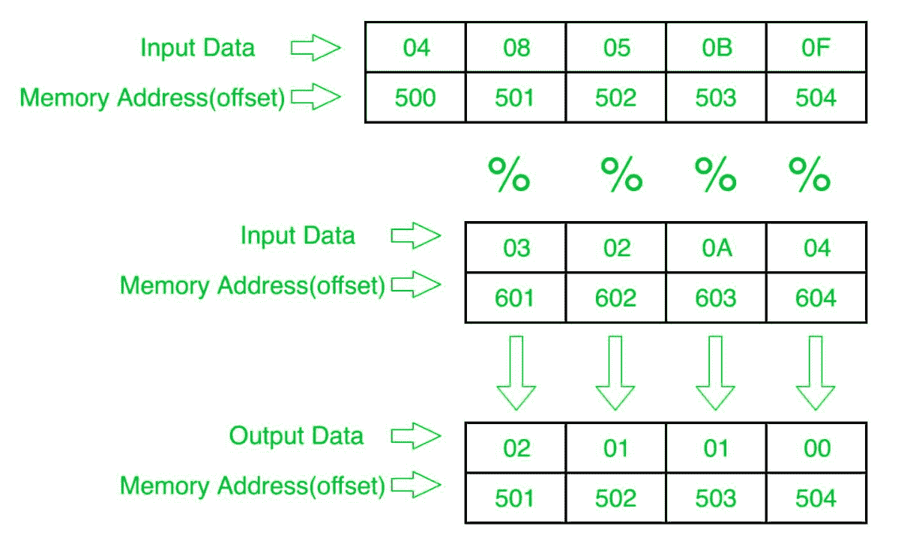

# 8086 程序确定第一个数组元素对应另一个数组元素的模数

> 原文:[https://www . geesforgeks . org/8086-程序确定第一个数组元素的模数-对应于另一个数组元素/](https://www.geeksforgeeks.org/8086-program-to-determine-modulus-of-first-array-elements-corresponding-to-another-array-elements/)

**问题–**在 8086 微处理器中编写一个程序，确定第一个数组的相应 8 位 n 个元素与第二个数组的 8 位 n 个数的模，其中大小“n”存储在偏移量 500 处，第一个数组的个数存储在偏移量 501 处，第二个数组的个数存储在偏移量 601 处，并将结果数存储到第一个数组即偏移量 501 处。

**示例–**

**算法–**

1.  将 500 存储到 SI，将 601 存储到 DI，并将来自偏移量 500 的数据加载到寄存器 CL，并将寄存器 CH 设置为 00(用于计数)。
2.  将 SI 值增加 1。
3.  从下一个偏移量(即 501)加载第一个数字(值)到寄存器 a1。
4.  在寄存器 AH 中存储 00。
5.  将寄存器 AX 中的值除以偏移量 DI 处的值。
6.  将结果(寄存器 AH 的值)存储到存储器偏移 SI。
7.  将 SI 值增加 1。
8.  将 DI 的值增加 1。
9.  循环到 6 以上，直到 CX 寄存器为 0。

**程序–**

| 存储地址 | 记忆术 | 评论 |
| --- | --- | --- |
| four hundred | MOV 是，500 | 国际标准 |
| Four hundred and three | mov cl 是] | cl |
| Four hundred and five | 莫夫·契尔 | CH |
| Four hundred and seven | 国际公司 | SI |
| Four hundred and eight | MOV，601 | DI |
| 40B | MOV AL，[是] | al |
| 40D | 莫夫啊，00 | AH |
| 40F | div[自] | ax = ax/[自] |
| Four hundred and eleven | mov[是]，啊 | AH->[SI] |
| Four hundred and thirteen | 国际公司 | SI |
| Four hundred and fourteen | 投资公司直接投资 | DI |
| Four hundred and fifteen | LOOP 40B | 如果 CX，跳到 40B！=0，CX=CX-1 |
| Four hundred and seventeen | HLT | 结束 |

**解释–**

1.  **MOV SI，500:** 将 SI 的值设置为 500
2.  **MOV CL、【SI】:**从偏移 SI 向寄存器 CL 加载数据
3.  **MOV 通道，00:** 将寄存器通道的值设置为 00
4.  **INC SI:**SI 值增加 1。
5.  **MOV DI，600:** 将 DI 的值设置为 600。
6.  **MOV a1、【SI】:**从偏移 SI 到寄存器 a1 的加载值
7.  **MOV AH，00:** 将寄存器 AH 的值设置为 00。
8.  **DIV [DI]:** 寄存器 AX 的值除以偏移量 DI 处的内容。
9.  **MOV [SI]，AH:** 存储偏移量 SI 处寄存器 AH 的值。
10.  **INC SI:**SI 值增加 1。
11.  **INC DI:**DI 值增加 1。
12.  **循环 408:** 如果 CX 不是 0，CX=CX-1，跳转到地址 408。
13.  **HLT:** 停止