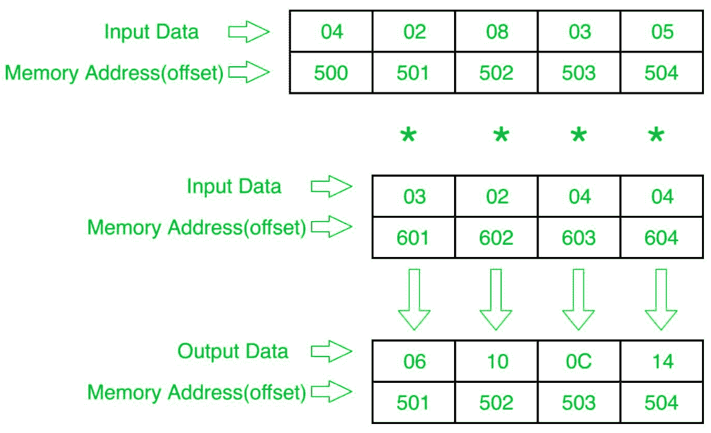

# 8086 程序确定两个数组元素对应元素的乘积

> 原文:[https://www . geesforgeks . org/8086-程序确定两个数组元素对应元素的乘积/](https://www.geeksforgeeks.org/8086-program-to-determine-product-of-corresponding-elements-of-two-array-elements/)

**问题–**在 8086 微处理器中编写一个程序，找出两个 8 位 n 个数数组的乘积，其中大小“n”存储在偏移量 500 处，第一个数组的个数从偏移量 501 开始存储，第二个数组的个数从偏移量 601 开始存储，并将结果个数存储到第一个数组即偏移量 501 中。

**示例–**

**算法–**

1.  将 500 存储到 SI，将 601 存储到 DI，并将来自偏移量 500 的数据加载到寄存器 CL，并将寄存器 CH 设置为 00(用于计数)。
2.  将 SI 值增加 1。
3.  从下一个偏移量(即 501)加载第一个数字(值)到寄存器 a1。
4.  将寄存器 a1 中的值乘以偏移量 DI 处的值。
5.  将结果(寄存器 A1 的值)存储到存储器偏移 SI。
6.  将 SI 值增加 1。
7.  将 DI 的值增加 1。
8.  循环 5 次以上，直到 CX 寄存器为 0。

**程序–**

| 存储地址 | 记忆术 | 评论 |
| --- | --- | --- |
| four hundred | MOV 是，500 | 国际标准 |
| Four hundred and three | mov cl 是] | cl |
| Four hundred and five | 莫夫·契尔 | CH |
| Four hundred and seven | 国际公司 | SI |
| Four hundred and eight | MOV，601 | DI |
| 40B | MOV AL，[是] | al |
| 40D | I [DI] | ax = al *[自] |
| 40F | mov[是]，AL | al >[是] |
| Four hundred and eleven | 国际公司 | SI |
| Four hundred and twelve | 投资公司直接投资 | DI |
| Four hundred and thirteen | LOOP 40B | 如果 CX，跳到 40B！=0，CX=CX-1 |
| Four hundred and fifteen | HLT | 结束 |

**解释–**

1.  **MOV SI，500:** 将 SI 的值设置为 500
2.  **MOV CL、【SI】:**从偏移 SI 向寄存器 CL 加载数据
3.  **MOV 通道，00:** 将寄存器通道的值设置为 00
4.  **INC SI:**SI 值增加 1。
5.  **MOV DI，600:** 将 DI 的值设置为 600。
6.  **MOV a1、【SI】:**从偏移 SI 到寄存器 a1 的加载值
7.  **寄存器 A1 的值乘以偏移量 DI 处的内容。**
8.  **MOV[S1]，A1:**存储偏移量 S1 处寄存器 A1 的值。
9.  **INC SI:**SI 值增加 1。
10.  **INC DI:**DI 值增加 1。
11.  **循环 408:** 如果 CX 不是 0，CX=CX-1，跳转到地址 408。
12.  **HLT:** 停止