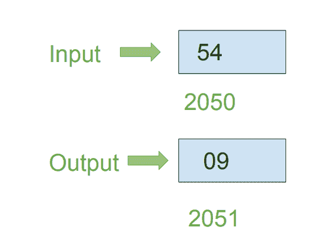

# 8086 程序求 8 位数字之和

> 原文:[https://www . geesforgeks . org/8086-程序查找 8 位数字的总和/](https://www.geeksforgeeks.org/8086-program-to-find-sum-of-digits-of-8-bit-number/)

**问题–**在 8086 微处理器中编写汇编语言程序，用 8 位运算求 8 位数字的位数和。

**示例–**假设 8 位数字存储在存储器位置 2050。

**假设–**输入数据和输出数据的地址分别为 2050 和 2051。

**算法–**

1.  加载寄存器 a1 中存储单元 2050 的内容
2.  将寄存器 a1 的内容复制到寄存器 AH
3.  将 0004 分配给 CX 寄存器对
4.  用 0F 对 A1 的内容进行与运算，并将结果存储在 A1 中
5.  通过使用 CX 执行 ROL 指令来旋转 AH 的内容
6.  用 0F 对 AH 的内容进行“与”运算，并将结果存储在 AH 中
7.  添加人工智能和人工智能内容，并将结果存储在人工智能中
8.  将 a1 的内容存储在内存位置 2051

**程序–**

| 存储地址 | 记忆术 | 评论 |
| --- | --- | --- |
| four hundred | MOV AL，[2050 年] | AL |
| Four hundred and four | 莫夫啊，阿尔 | 啊 |
| Four hundred and six | mov CX 0004 | CX |
| Four hundred and nine | 和 A1，0F | AL |
| 40B | 角色 AH，CX | 将 AH 内容向左旋转 4 位(CX 值) |
| 40D | 啊，0F | 啊 |
| 40F | 添加铝，啊 | AL |
| Four hundred and eleven | MOV [2051]号文件 | [2051] |
| Four hundred and fifteen | HLT | 停止执行 |

**解释–**

1.  **MOV a1，[2050]:** 加载 a1 中的存储单元 2050 的内容
2.  **MOV AH，AL:** 将寄存器 a1 的内容复制到寄存器 AH
3.  **MOV·CX，0004:** 将 0004 分配给 CX 寄存器对
4.  **和 a1，0F:** 用 0F 对 a1 的含量进行 AND 运算，并将结果存储在 a1 中
5.  **CX ROL AH:**将 AH 寄存器的内容向左旋转 4 位，即 CX 寄存器对的值
6.  **和 AH，0F:** 用 0F 对 AH 的内容进行 AND 运算，并将结果存储在 AH 中
7.  **添加 AL、AH:** 添加 AL 和 AH 含量，并将结果存储在 AL 中
8.  **MOV [2051]，AL:** 将 AL 的内容存储在 2051 内存地址中
9.  **HLT:** 停止执行程序