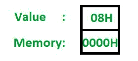
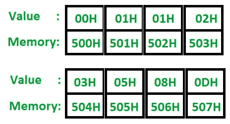
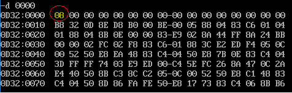
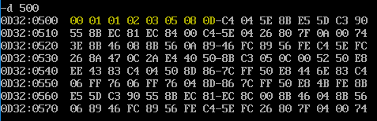

# 8086 程序生成斐波那契数列

> 原文:[https://www . geesforgeks . org/8086-程序生成斐波那契序列/](https://www.geeksforgeeks.org/8086-program-to-generate-fibonacci-sequence/)

**问题–**编写一个 8086 汇编级程序，生成斐波那契数列。序列的长度存储在偏移值为 0 的数据段中。我们将从偏移量 500 开始，将生成的序列存储在数据段中。
***注:*** 生成的数字和内存位置以六进制格式表示。

**例:**
**输入:**

**输出:**

**算法:**
斐波那契数列是通过将第(I)个元素和第(i-1)个元素相加，并将其存储到第(i+1)个位置而生成的。考虑到第一和第二个位置分别用 0 和 1 初始化，这是成立的。使用汇编级指令执行过程需要遵循以下步骤。

1.  将偏移量 00H 处存储的值移入 CX(这将充当计数器)，并将其减 2(因为我们需要显式加载序列的前 2 个元素)
2.  将 00H 移入 A1
3.  将 500 移入国际单位制
4.  将人工智能移入[人工智能]
5.  将 a1 和 SI 都增加 1，并将 a1 的值存储在[SI]中(这样，我们已经将序列的前 2 个元素加载到内存中)
6.  将第[SI-1]个值移入 a1
7.  将第[SI]个值移入 AH
8.  将 00H 移入 BH
9.  添加 BH 和 AH(结果存储在 BH 中)
10.  用铝再次添加 BH
11.  将 SI 增加 1
12.  将 BH 存储到[SI]中
13.  循环回到步骤 6，直到计数器变为 0
14.  停止

**程序:**

| 存储地址 |

指令/助记符解释/评论Two thousandmov al.00 h
- 00 点Two thousand and twoMOV 是，500 小时国际标准Two thousand and fivemov[是]，AL[国际标准] Two thousand and seven添加国际单位制，01HSI 200A添加铝，01H阿尔200 摄氏度mov[是]，AL是200EMOV CX，[0000H]CX Two thousand and twelveCX，0002 小时客户体验 < 客户体验 - 02~2015L1:标签Two thousand and fifteenMOV AL，[SI-1]al Two thousand and eighteen添加到[是]al 201A添加 SI，01HSI 201Dmov[是]，AL[是] 201F步行 L1L1 CX 时报Two thousand and twenty-oneHLTEND

**说明:**

1.  **MOV a1，00H:**a1 现在具有序列中的第一个数字
2.  **MOV 国际单位制，500 小时:**使国际单位制指向输出位置
3.  **MOV【SI】，阿尔:**移动 0 到第一位置
4.  **添加 SI，1:** 增加 SI 指向下一个内存位置
5.  **添加 a1，1:** 现在，a1 具有序列的第二个元素
6.  **MOV【SI】，AL:** 移动 01H 到第二位置
7.  **MOV·CX，[0000H]:** 将偏移量 0 处存储的值移入 CX(计数器)
8.  **SUB CX，02H:** 由于我们已经初始化了序列的前 2 个元素，我们需要将计数器减 2
9.  **L1:** 这定义了循环的开始(创建了一个标签)
10.  **MOV a1，[SI-1]:** 将第(I-1)个位置的元素移动到 a1
11.  **添加 AL，[SI]:** 移动 AL 中已经存在的第(i-1)个元素的第(I)个元素
12.  **添加 SI，1:** 增加 SI 指向下一个位置
13.  **MOV [SI]，AL:** 将总和存储在新位置
14.  **LOOP L1:** 标签 L1 和该 LOOP 指令之间的指令执行“CX”次
15.  **HLT:** 结束程序

## 实际输出:

带圆圈的内存位置(0000)包含序列的长度。对于这个程序，它是 8。

突出显示的值是斐波那契数列的元素(以六进制表示)。因此，13 表示为 0D)

参考: [8085 程序生成斐波那契数列](https://www.geeksforgeeks.org/?p=201540)

享受编码！