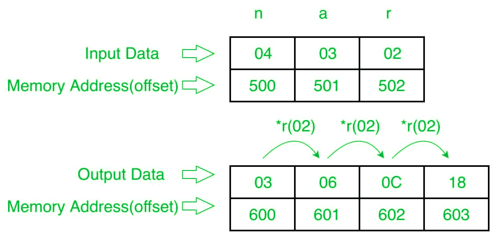

# 8086 程序生成 n 个数的 G.P 系列

> 原文:[https://www . geesforgeks . org/8086-程序生成-g-p-系列-n-numbers/](https://www.geeksforgeeks.org/8086-program-to-generate-g-p-series-of-n-numbers/)

**问题–**在 8086 微处理器中编写一个程序，生成 n 个数字的 G.P(几何级数)序列(数字只有 8 位)，其中大小“n”存储在偏移量 500 处，第一个数字(a)存储在偏移量 501 处，存储公共比率存储在偏移量 502 处。将系列存储到偏移 600。

**示例–**

**算法–**

1.  将 500 存储到 SI，将 600 存储到 DI 将偏移量 500 的数据加载到寄存器 CL，并将寄存器 CH 设置为 00(用于计数)。
2.  将 SI 值增加 1。
3.  从下一个偏移量(即 501)加载第一个数字(值)到寄存器 a1。
4.  将寄存器 a1 的值存储到内存偏移 DI。
5.  将 DI 增加 1。
6.  将 CL 减少 1。
7.  从下一个偏移量(即 502)加载第二个数字(公共比率)到寄存器 BL。
8.  将寄存器 A1 和 BL 相乘。
9.  将结果(寄存器 a1 的值)存储到内存偏移 DI。
10.  将 SI 值增加 1。
11.  循环 3 以上，直到 CX 寄存器得到 0。

**程序–**

| 存储地址 | 记忆术 | 评论 |
| --- | --- | --- |
| four hundred | MOV 是，500 | 国际标准 |
| Four hundred and three | mov cl 是] | cl |
| Four hundred and five | 莫夫·契尔 | CH |
| Four hundred and seven | 国际公司 | SI |
| Four hundred and eight | MOV AL，[是] | al |
| 40A | 国际公司 | SI |
| 40B | MOV，600 磅 | DI |
| 40E | MOV [DI]，AL | [发件人] |
| Four hundred and ten | 投资公司直接投资 | DI |
| Four hundred and eleven | DEC CL | CL |
| Four hundred and twelve | mov bl 是] | BL |
| Four hundred and fourteen | 穆尔 BL | AX |
| Four hundred and sixteen | MOV [DI]，AL | [发件人] |
| Four hundred and eighteen | 投资公司直接投资 | DI |
| Four hundred and nineteen | 回路 414 | 跳到 414 如果 CX！=0，CX=CX-1 |
| 41B | HLT | 结束 |

**解释–**

1.  **MOV SI，500:** 将 SI 的值设置为 500。
2.  **MOV CL、【SI】:**从偏移 SI 向寄存器 CL 加载数据。
3.  **MOV 通道，00:** 将寄存器通道的值设置为 00。
4.  **INC SI:**SI 值增加 1。
5.  **MOV 寄存器 A1、【SI】:**从偏移 SI 加载值到寄存器 A1。
6.  **INC SI:**SI 值增加 1。
7.  **MOV DI，500:** 将 DI 的值设置为 600。
8.  **MOV [DI]，a1:**在偏移 D1 存储寄存器 a1 的值。
9.  **INC DI:**DI 值增加 1。
10.  **DEC CL:** 将寄存器 CL 的值减少 1。
11.  **MOV BL、【SI】:**从偏移 SI 加载值到寄存器 BL。
12.  **MUL BL:** 寄存器 a1 的值乘以 BL。
13.  **MOV [DI]，a1:**在偏移 D1 存储寄存器 a1 的值。
14.  **INC DI:**DI 值增加 1。
15.  **LOOP 414:** 如果 CX 不是 0，CX=CX-1，跳转到地址 414。
16.  **HLT:** 停止