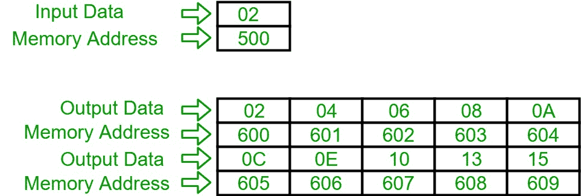

# 8086 程序打印输入整数的表格

> 原文:[https://www . geesforgeks . org/8086-程序打印输入整数表/](https://www.geeksforgeeks.org/8086-program-to-print-the-table-of-input-integer/)

**问题–**用 8086 编写汇编语言程序，打印输入整数的表格。

**假设–**假设输入的数字在内存位置 500，表格将以十六进制从起始位置 600 打印到 609。

**示例–**

**算法–**

1.  在 SI 中加载输入数字地址，并且在 DI 中加载我们想要输出的地址。

2.  在 CH 寄存器中存储 00。

3.  将 CH 的值增加 1，并将[SI]的内容移入 AH 寄存器。

4.  将 a1 和 CH 的内容相乘并存储在 AX 中，然后将 a1 的内容移入[DI]，然后将 DI 的值增加 1。

5.  比较 CH 和 0A 的值，如果不相等，则进入步骤 3，否则暂停程序。

**程序–**

<figure class="table">

| 地址 | 记忆术 | 评论 |
| --- | --- | --- |
| four hundred | MOV 是，500 | 国际标准 |
| Four hundred and three | MOV，600 磅 | DI |
| Four hundred and six | 莫夫·契尔 | CH |
| Four hundred and eight | INC CH | CH |
| Four hundred and nine | MOV AL，[是] | al |
| 40B | 穆尔 | AX |
| 40D | MOV [DI]，AL | [发件人] |
| 40F | 投资公司直接投资 | DI |
| Four hundred and ten | 凸轮轴位置，0A | CH-0A |
| Four hundred and thirteen | JNZ 408 | 如果零标志为 0，跳转到地址 408 |
| Four hundred and fifteen | HLT | 终止程序 |

**解释–**

1.  **MOV SI，500:** 负荷 500 in SI。

2.  **MOV DI，600:** 负荷 600 in DI。

3.  **MOV 通道，00:** 在通道寄存器中加载 00 数据。

4.  **INC CH:** 将 CH 寄存器内的值增加 1。

5.  **MOV a1，SI:** 将 SI 的内容移入 a1 寄存器。

6.  **MUL CH:** 将 AL 和 CH 寄存器的内容相乘，存入 AX 寄存器。

7.  **MOV [DI]，a1:**将 a1 寄存器的内容移入[DI]。

8.  **INC DI:** 将 DI 的值增加 1。

9.  **CMP CH，0A:** 减去 CH 寄存器和 0A 内的数据。

10.  **JNZ 408:** 如果零标志为 0，跳转到地址 408。

11.  **HLT:** 终止程序。

</figure>