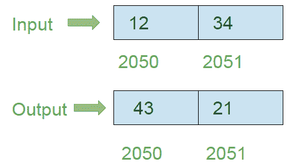

# 8086 程序使用 8 位操作反转 16 位数字

> 原文:[https://www . geeksforgeeks . org/8086-程序到反向 16 位数字-使用 8 位操作/](https://www.geeksforgeeks.org/8086-program-to-reverse-16-bit-number-using-8-bit-operation/)

**问题–**在 8086 微处理器中编写汇编语言程序，使用 8 位操作反转 16 位数字。

**示例–**假设 16 位数字存储在存储器位置 2050 和 2051。

**算法–**

1.  加载寄存器 a1 中存储单元 2050 的内容
2.  在寄存器 AH 中加载存储单元 2051 的内容
3.  将 0004 分配给 CX 寄存器对
4.  通过使用 CX 执行 ROL 指令来旋转人工智能的内容
5.  通过使用 CX 执行 ROL 指令来旋转 AH 的内容
6.  将 AH 的内容存储在内存位置 2050
7.  将 a1 的内容存储在内存位置 2051

**程序–**

| 存储地址 | 记忆术 | 评论 |
| --- | --- | --- |
| four hundred | MOV AL，[2050 年] | AL |
| Four hundred and four | 莫夫啊，[2051] | AH |
| Four hundred and eight | mov CX 0004 | CX |
| 40B | AL 角色，CX | 将铝含量向左旋转 4 位(CX 值) |
| 40D | 角色 AH，CX | 将 AH 内容向左旋转 4 位(CX 值) |
| 40F | MOV [2050]，啊 | [2050] |
| Four hundred and thirteen | MOV [2051]号文件 | [2051] |
| Four hundred and seventeen | HLT | 停止执行 |

**解释–**

1.  **MOV a1，[2050]:** 加载 a1 中的存储单元 2050 的内容
2.  **MOV AH，[2051]:** 加载 AH 中的内存位置 2051 的内容
3.  **MOV·CX，0004:** 将 0004 分配给 CX 寄存器对
4.  **CX ROL a1:**将 a1 寄存器的内容向左旋转 4 位，即 CX 寄存器对的值
5.  **CX ROL AH:**将 AH 寄存器的内容向左旋转 4 位，即 CX 寄存器对的值
6.  **MOV【2050】，AH:** 将 AH 的内容存储在 2050 内存地址中
7.  **MOV [2051]，AL:** 将 AL 的内容存储在 2051 内存地址中
8.  **HLT:** 停止执行程序