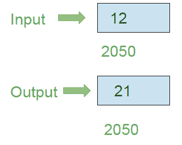

# 8086 程序使用 8 位操作反转 8 位数字

> 原文:[https://www . geesforgeks . org/8086-使用 8 位操作程序反转 8 位数字/](https://www.geeksforgeeks.org/8086-program-to-reverse-8-bit-number-using-8-bit-operation/)

**问题–**在 8086 微处理器中编写汇编语言程序，使用 8 位操作反转 8 位数字。

**示例–**假设 8 位数字存储在存储器位置 2050

**算法–**

1.  加载寄存器 a1 中存储单元 2050 的内容
2.  将 0004 分配给 CX 寄存器对
3.  通过使用 CX 执行 ROL 指令来旋转人工智能的内容
4.  将 a1 的内容存储在存储单元 2050 中

**程序–**

| 存储地址 | 记忆术 | 评论 |
| --- | --- | --- |
| four hundred | MOV AL，[2050 年] | AL |
| Four hundred and four | mov CX 0004 | CX |
| Four hundred and seven | AL 角色，CX | 将铝含量向左旋转 4 位(CX 值) |
| Four hundred and nine | MOV [2050 年]，第 1 段 | [2050] |
| 40D | HLT | 停止执行 |

**解释–**

1.  **MOV a1，【2050】**加载 a1 中存储单元 2050 的内容
2.  **MOV CX，0004** 将 0004 分配给 CX 寄存器对
3.  **CX ROL a1**将 a1 寄存器的内容向左旋转 4 位，即 CX 寄存器对的值
4.  **MOV【2050】，AL** 将 AL 的内容存储在 2050 内存地址中
5.  **HLT** 停止执行程序