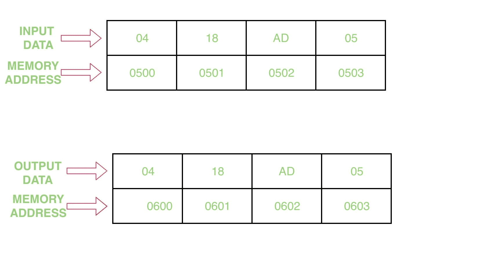

# 8086 程序使用字符串指令

传输一个 4 字节的块

> 原文:[https://www . geesforgeks . org/8086-程序-传输-块-4 字节-使用字符串-指令/](https://www.geeksforgeeks.org/8086-program-transfer-block-4-bytes-using-string-instructions/)

**问题–**编写一个程序，传输一个 4 字节的块，起始地址为 0500，使用字符串指令传输地址为 0600 的块。

**示例–**

**假设–**假设内存地址 0500、0501、0502、0503 中有 4 个块。

**算法–**

1.  在国际单位制中赋值 500，在直接投资中赋值 600
2.  将值 0000 分配给 AX
3.  在 DS 中移动 AX 的内容
4.  在 ES 中移动 AX 的内容
5.  将值 0004 H 分配给 CX
6.  清除方向标志
7.  重复直到 CX=0，移动字符串块
8.  节目暂停

**程序–**

| 存储地址 | 记忆术 | 评论 |
| --- | --- | --- |
| 0400 | MOV 是，500 | 国际标准 |
| 0403 | MOV，600 磅 | DI |
| 0406 | MOV AX，0000 | AX |
| 0409 | MOV DS，AX | DS |
| 040B | MOV 它，AX | 是 |
| 040D | mov CX 0004 | CX |
| 0410 | CLD | 清除方向标志 |
| 0411 | 代表 | 重复直到 CX=0 |
| 0412 | MOVSB(联合宇航公司) | 移动区块 |
| 0413 | HLT | 计划结束 |

**解释–**

1.  MOV 国际标准，500 指定 500 给国际标准
2.  MOV DI，600 分配 600 给 DI
3.  MOV AX，00 将 0000 分配给 AX 寄存器
4.  MOV DS，AX 将 AX 的内容移动到 DS 段
5.  MOV ES，AX 将 AX 的内容移动到 ES 段
6.  MOV·CX，0004 将 0000 分配给 CX 注册
7.  CLD 清除了方向旗
8.  重复，直到 CX=0
9.  移动管柱块
10.  HLT 停止程序的执行。