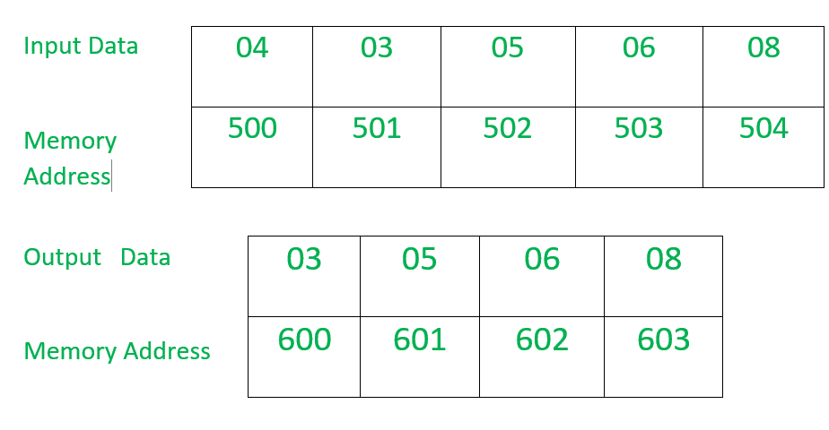

# 8086 程序使用字符串指令

传输一个字节块

> 原文:[https://www . geesforgeks . org/8086-程序-传输-块-字节-使用-字符串-指令/](https://www.geeksforgeeks.org/8086-program-transfer-block-bytes-using-string-instruction/)

**问题–**编写一个汇编语言程序，通过使用字符串指令将一个字节块从一个存储位置传输到另一个存储位置。

**示例–**



**示例–**

1.  在本例中，存储在 CX 寄存器中的计数器值为 4。
2.  从从 501 到 504 偏移开始的存储位置存储的数据块被传送到从 600 到 603 偏移开始的另一个存储位置。

**假设–**

*   指示要传输的字节数的计数器值存储在偏移量 500 处。*   从 501 开始，必须传输 8 位数据被存储在连续的存储单元中。*   数据从 600 开始被传送到连续的存储位置。*   DS 和 ES 的值取等于 0000。*   the program starts from offset 400.

    **CLD** 指令用于清除方向标志，即 DF=0。现在，SI 和 DI 的值将会增加。

    ```
     SI=SI+1
     DI=DI+1 
    ```

    **REP** 指令用于重复该步骤，直到 CX 值不等于零，并且 CX 值在每一步递减 1，即，

    ```
    CX=CX-1 
    ```

    **MOVSB** 指令仅用于将字节从源存储单元(MADS)传输到目的存储单元(MAES)。

    ```
    MADS-->MAES
    where MADS=DS*10+SI
          MAES=ES*10+DI 
    ```

    这里，SI 和 DI 的值会自动更新。

    ```
    if DF=0, SI=SI+1 and DI=DI+1  
    ```

    **算法–**

    1.  将偏移 SI 的值设置为 500。
    2.  将偏移 DI 的值设置为 600。
    3.  将值 0000 载入寄存器 AX。
    4.  将 AX 寄存器的数据装入 DS(数据段)。
    5.  将 AX 寄存器的数据加载到 ES(额外段)中。
    6.  将偏移 SI 的数据载入 CL 寄存器，将值 00 载入 CH 寄存器。
    7.  将 SI 的值增加 1。
    8.  清除方向标志，以便将数据从较低的存储器读取到较高的存储器位置。
    9.  检查 CX 值，如果不等于零，则重复步骤 10，否则转到步骤 11。
    10.  将数据从源内存位置传输到目标内存位置，并将 CX 值减少 1。
    11.  停下来。

    **程序–**

    | 地址 | 记忆术 | 评论 |
    | --- | --- | --- |
    | 0400 | MOV 是，500 | 国际标准 |
    | 0403 | 0.00 的 MOV | DI |
    | 0406 | MOV AX，0000 | AX |
    | 0409 | MOV DS，AX | DS |
    | 040B | MOV 它，AX | 是 |
    | 040D | mov cl 是] | cl | 0410 | 莫夫·契尔 | CH |
    | 0412 | 国际公司 | SI |
    | 0413 | CLD | 清除方向标志 |
    | 0414 | 代表 | 重复直到 CX 不等于零
    并且 CX=CX-1 |
    | 0415 | MOVSB(联合宇航公司) | 将数据从源存储位置传输到目标存储位置 |
    | 0416 | HLT | 结束 |

    **解释–**

    1.  **MOV SI，500:** 将值 500 加载到 offet SI 中。
    2.  **MOV DI，600:** 将值 600 载入偏移 DI。
    3.  **MOV AX，0000:** 将值 0000 载入 AX 寄存器。
    4.  **MOV DS，AX:** 将 AX 寄存器的值载入 DS(数据段)。
    5.  **MOV ES，AX:** 将 AX 寄存器的值载入 ES(额外段)。
    6.  **MOV CL、【SI】:**将偏移 SI 的数据载入 CL 寄存器。
    7.  **MOV 通道，00:** 将值 00 载入通道寄存器。
    8.  **INC SI:** 将 SI 的值增加 1。
    9.  **CLD:** 清除方向标志，即 DF=0。
    10.  **REP:** 重复，直到 CX 值不等于零，每一步将 CX 值递减 1。
    11.  **MOVSB:** 将数据从源内存位置传输到目的内存位置。
    12.  **HLT:** 结束。