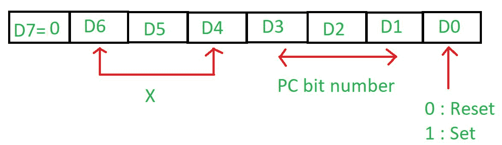
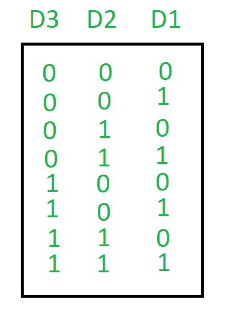
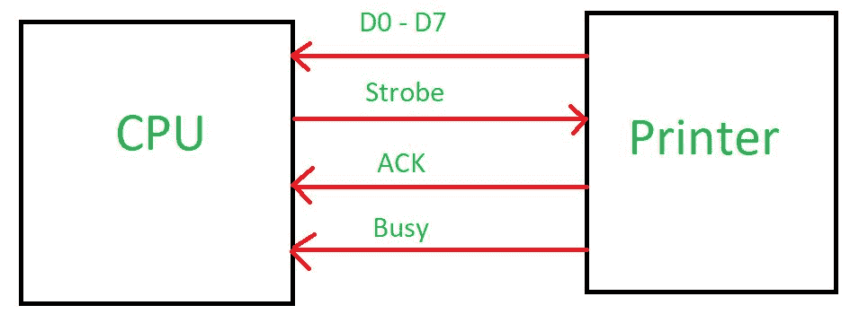
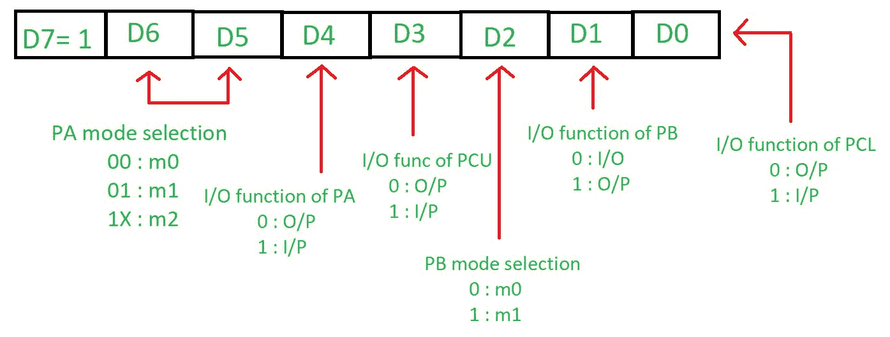
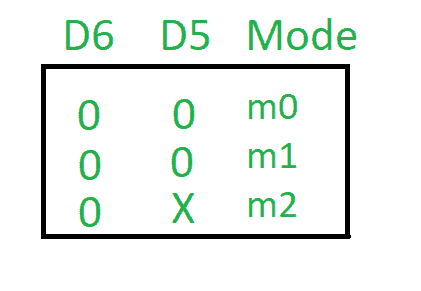

# 8255 微处理器操作模式

> 原文:[https://www . geesforgeks . org/8255-微处理器-操作-模式/](https://www.geeksforgeeks.org/8255-microprocessor-operating-modes/)

8255 微处理器有两种模式:

**1。位设置复位(BSR)模式–**该模式仅用于设置或复位端口 C 的位，当控制寄存器的最高有效位(D7)为 0 时选择。控制寄存器如下:

这种模式一次只影响端口 C 的一个位，因为当用户设置该位时，它会一直保持设置，直到用户更改它。用户需要载入控制寄存器中的位模式来改变位。

**2。输入/输出模式(输入/输出)–**当控制寄存器的最高有效位(D7)为 1 时，选择该模式。

*   **模式 0–简单或基本输入/输出模式:**
    端口 A、B 和 C 可以作为输入功能或输出功能。输出被锁存，但输入未被锁存。它具有中断处理能力。
*   **Mode 1 – Handshake or strobbed I/O:**
    In this either port A or B can work and port C bits are used to provide handshaking. The outputs as well as inputs are latched. It has interrupt handling capability. Before actual data transfer there is transmission of signal to match speed of CPU and printer.

    **例:**当 CPU 想向打印机这样速度较慢的外设发送数据时，会向打印机发送握手信号，告知是否准备好传输数据。当打印机准备就绪时，它将向中央处理器发送一个确认，然后通过数据总线传输数据。

    

*   **Mode 2 – Bidirectional I/O:**
    In this mode only port A will work, port B can either is in mode 0 or 1 and port C bits are used as handshake signal. The outputs as well as inputs are latched. It has interrupt handling capability. Control Register is as follows:

    

    输入/输出模式的最高有效位( **D7** )为 1，BSR 模式为 0。

    **D6 & D5** 用于设置 A 口模式。

    

    **D4** 用于判断 A 口是在进行输入还是在显示结果。如果为 1，则它接受输入，否则显示输出。
    **D3** 用于判断 C 口高位是取输入还是显示结果。如果为 1，则它接受输入，否则显示输出。
    **D2** 告知端口 B 的模式，如果为 0，则端口 B 处于 m0 模式，否则处于 m1 模式。
    **D1** 用于判断 B 口是在取输入还是在显示结果。如果为 1，则它接受输入，否则显示输出。
    **D0** 用于判断 C 口低位是取输入还是显示结果。如果为 1，则它接受输入，否则显示输出。

当 8255 微处理器复位时，它将清除控制字寄存器内容，将所有端口设置为输入模式。