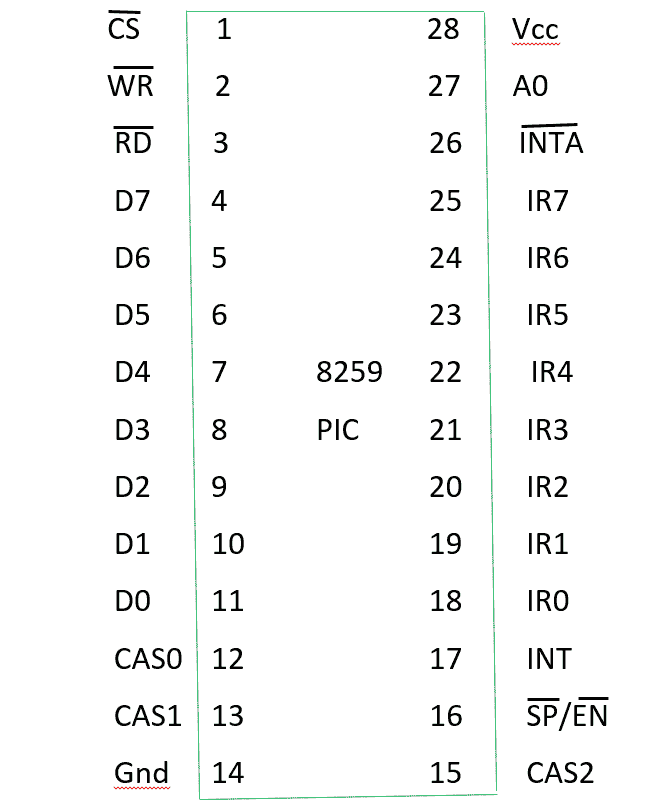
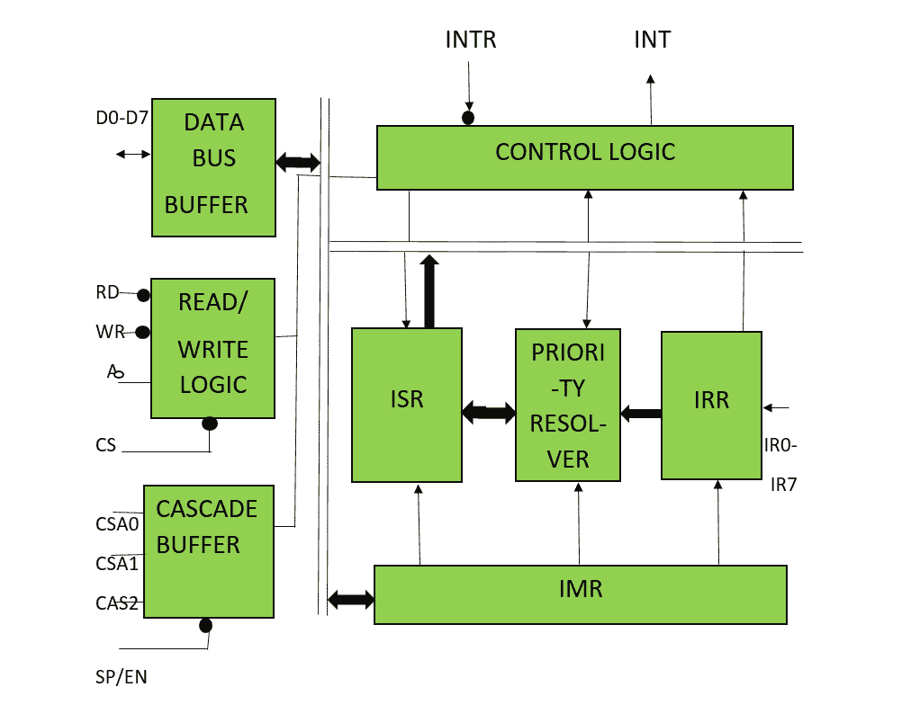

# 8259 PIC 微处理器

> 原文:[https://www.geeksforgeeks.org/8259-pic-microprocessor/](https://www.geeksforgeeks.org/8259-pic-microprocessor/)

8259 微处理器定义为**可编程中断控制器(PIC)** 微处理器。8085 和 8086 分别有 5 个硬件中断和 2 个硬件中断。但是通过连接 8259 和 CPU，我们可以增加中断处理能力。8259 将多个中断输入源组合成一个中断输出。单个 PIC 的接口提供来自 IR0-IR7 的 8 个中断输入。

例如，8085 和 8259 的接口将 8085 微处理器的中断处理能力从 5 级提高到 8 级。

**8259 PIC 微处理器的特点–**

1.  英特尔 8259 是为英特尔 8085 和英特尔 8086 微处理器设计的。
2.  它可以编程为电平触发或边沿触发中断电平。
3.  我们可以屏蔽中断请求寄存器的各个位。
4.  通过进一步级联 8259 PIC，我们可以将中断处理能力提高到 64 中断级别。
5.  不需要时钟周期。

**8259 引脚图–**

从上图可以看出，8259 PIC 微处理器共有 28 个引脚，其中 Vcc :5V 电源，Gnd:地。其他引脚使用解释如下。

**8259 PIC 微处理器框图–**

该框图由 8 个模块组成，分别是:数据总线缓冲器、读/写逻辑、级联缓冲器比较器、控制逻辑、优先级解析器和 3 个寄存器——中断参考寄存器、内部参考寄存器和内部参考寄存器。

1.  **数据总线缓冲器–**
    该模块作为缓冲器，用作 8259 和 8085/8086 微处理器之间的中介。它从 8085(比方说)微处理器获取控制字，并将其传送到 8259 微处理器的控制逻辑。此外，在 8259 微处理器选择中断后，它将所选中断的操作码和中断服务子程序的地址传送给另一个相连的微处理器。数据总线缓冲器由 8 位组成，在框图中表示为 D0-D7。因此，显示一次最多可以传输 8 位数据。
2.  **读/写逻辑–**
    该模块仅在引脚 CS 的值为低电平时工作(因为该引脚为低电平有效)。该模块根据研发和 WR 的输入负责数据流。这两个引脚是低电平有效引脚，用于读写操作。
3.  **控制逻辑–**
    它是微处理器的中心，控制着每个模块的功能。它的引脚 INTR 与其他微处理器相连，用于接收中断请求，引脚 INT 用于给出输出。如果 8259 被使能，并且另一个微处理器中断标志为高，则这导致输出 INT 引脚的值为高，并且以这种方式 8259 响应另一个微处理器的请求。
4.  **中断请求寄存器(IRR)–**
    它存储所有请求中断服务的中断级别。
5.  **中断服务寄存器(ISR)–**
    它存储当前正在执行的中断级别。
6.  **中断屏蔽寄存器(IMR)–**
    它存储中断级别，必须通过存储中断级别的屏蔽位来屏蔽中断级别。
7.  **优先级解析器–**
    它检查所有三个寄存器并设置中断的优先级，根据中断的优先级，在 ISR 寄存器中设置优先级最高的中断。此外，它还会重置已经在 IRR 中服务的中断级别。
8.  **级联缓冲器–**
    为了增加中断处理能力，我们可以通过使用级联缓冲器进一步级联更多数量的引脚。因此，在增加中断能力的过程中，使用 CSA 线来控制多个中断结构。

SP/EN(从程序/使能缓冲器)引脚设置为高电平时，在主模式下工作，否则在从模式下工作。在非缓冲模式下，SP/EN 引脚用于指定 8259 是作为主机还是从机工作，在缓冲模式下，SP/EN 引脚用作使能数据总线的输出。