# 数字逻辑中的加法器和减法器

> 原文:[https://www . geesforgeks . org/数字逻辑中的加法器和减法器/](https://www.geeksforgeeks.org/adders-and-subtractors-in-digital-logic/)

[组合逻辑电路](https://www.geeksforgeeks.org/difference-between-combinational-and-sequential-circuit/)框图:

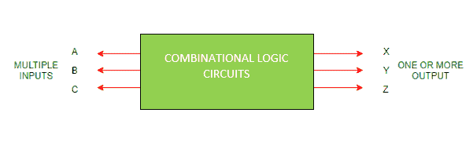

**组合逻辑电路需要记住的点:**

1.  输出取决于输入的组合。
2.  输出仅是当前输入的纯函数，即先前状态输入不会对输出产生任何影响。另外，它不使用内存。
3.  换句话说，

    ```
    OUTPUT=f(INPUT)
    ```

4.  输入称为电路激励，输出称为组合逻辑电路响应。

**组合逻辑电路分类:**

**1。算术:**

*   地址
*   减法器
*   乘数
*   比较仪

**2。数据处理:**

*   多路器
*   多路分解器
*   编码器和解码器

**3。代码转换器:**

*   BCD 到超额-3 代码，反之亦然
*   BCD 到格雷码，反之亦然
*   七段

**半加法器和全加器的设计:**

*   执行两位相加的组合逻辑电路称为半加法器。
*   执行三个单个位相加的组合逻辑电路称为全加器。

**1。[半加法器](https://www.geeksforgeeks.org/digital-electronics-half-adder/) :**

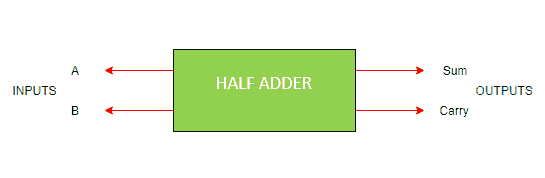

*   它是一种算术组合逻辑电路，设计用于执行两个单个位的相加。
*   它包含两个输入并产生两个输出。
*   输入称为加法和加法位，输出称为求和和进位。

让我们观察一下单个位的**加法，**

```
0+0=0
0+1=1
1+0=1
1+1=10
```

由于 1+1=10，结果必须是两位输出。所以，上面可以改写为，

```
0+0=00
0+1=01
1+0=01
1+1=10
```

1+1 的结果是 10，其中“1”是进位输出(C <sub>输出</sub>),“0”是和输出(正常输出)。

**半加法器真值表:**

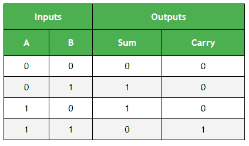

下一步是绘制逻辑图。绘制逻辑图，需要布尔表达式，可以使用 [K-map(卡诺图)](https://www.geeksforgeeks.org/k-mapkarnaugh-map/)得到。由于有两个输出变量“S”和“C”，我们需要为每个输出变量定义 K-map。

**输出变量总和的 K 图:**

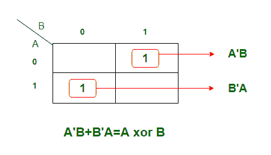

k 图为**积之和**形式。得到的方程是

```
 S = AB' + A'B 
```

逻辑上可以写成，

```
S = A xor B
```

**输出变量进位“C”的 K 图:**

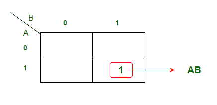

从 k 线图得到的方程是，

```
C = AB
```

使用布尔表达式，我们可以绘制如下逻辑图..

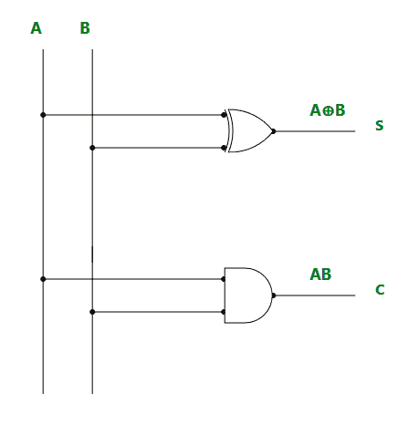

**限制:**
在半加法器中进位相加是不可能的。

**2。[全加器](https://www.geeksforgeeks.org/full-adder-digital-electronics/) :**

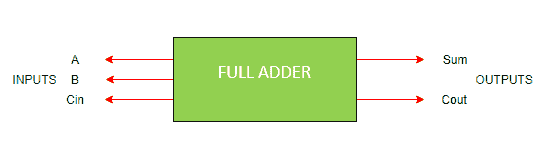

*   为了克服半加法器面临的上述限制，实现了全加器。
*   它是一个算术组合逻辑电路，执行三个单个位的加法。
*   它包含三个输入(在中为 A、B、C <sub>)并产生两个输出(在</sub>中为 Sum 和 C <sub>)。</sub>
*   其中，C <sub>在</sub> - >运入，C <sub>运出</sub> - >运出

**全加器真值表:**

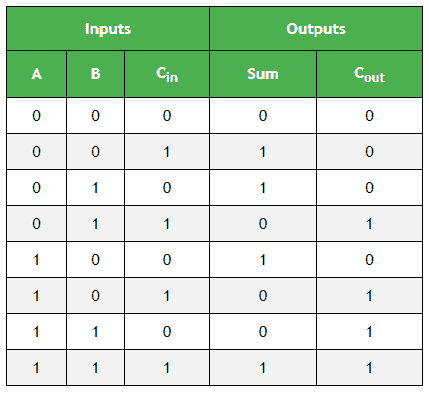

**输出变量总和的 K 图简化:**


得到的方程是，

```
S = A'B'Cin + AB'Cin' + ABC + A'BCin' 
```

该方程可以简化为，

```
S = B'(A'Cin+ACin') + B(AC + A'Cin')
S = B'(A xor Cin) + B (A xor Cin)'
S = A xor B xor Cin 
```

**输出变量**的 K 图简化


得到的方程是，

```
Cout = BCin + AB + ACin 
```

**全加器逻辑图:**

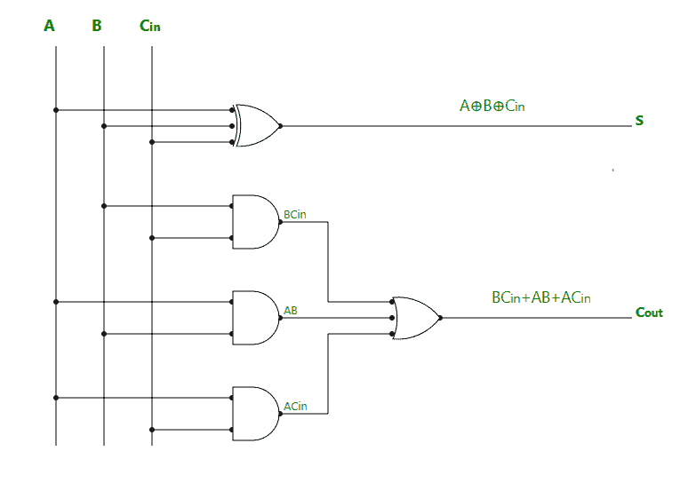

**3。[半减法器](https://www.geeksforgeeks.org/digital-electronics-half-subtractor/) :**


*   它是一种组合逻辑电路，设计用于执行两位的减法运算。
*   它包含两个输入(A 和 B)并产生两个输出(差输出和借输出)。

**半减法器真值表:**

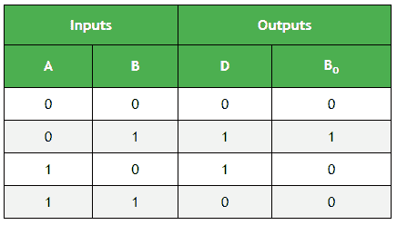

**输出变量“D”的 K 图简化:**

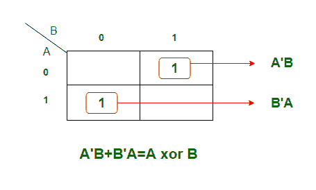

得到的方程是，

```
D = A'B + AB'
```

逻辑上可以写成，

```
D = A xor B 
```

**输出变量“B <sub>输出</sub>”的 K 图简化:**

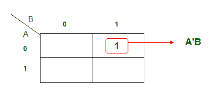

从上面的 K 图得到的方程是，

```
Bout = A'B 
```

**半减法器逻辑图:**

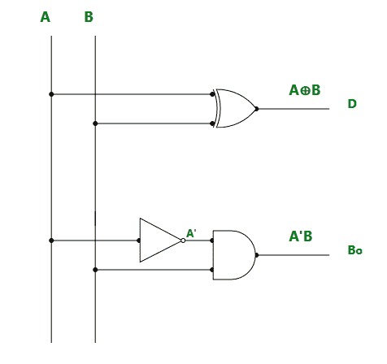

**4。[全减法器](https://www.geeksforgeeks.org/digital-logic-full-subtractor/) :**

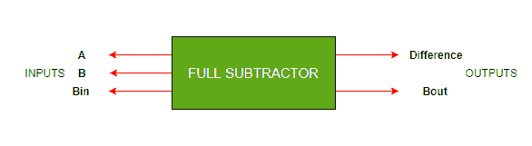

*   它是一种组合逻辑电路，设计用于执行三个单个位的减法运算。
*   它包含三个输入(在中为 A、B、B <sub>，产生两个输出(在</sub>中为 D、B <sub>)。</sub>
*   其中，A 和 B 称为**被减数**和**减数**位。
*   并且，B <sub>在</sub> - >借入，B <sub>出</sub> - >借出

**全减法器真值表:**

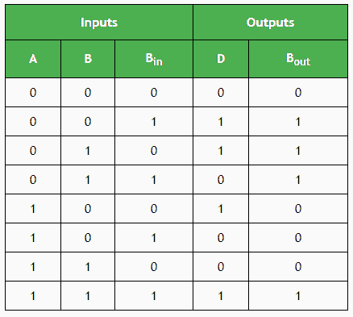

**输出变量“D”的 K 图简化:**

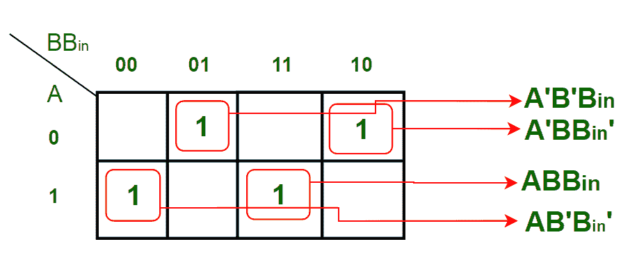

从上面的 K 图得到的方程是，

```
D = A'B'Bin + AB'Bin' + ABBin + A'BBin'
```

这可以简化为，

```
D = B'(A'Bin + ABin') + B(ABin + A'Bin')
D = B'(A xor Bin) + B(A xor Bin)'
D = A xor B xor Bin 
```

**输出变量“B <sub>输出</sub>”的 K 图简化:**

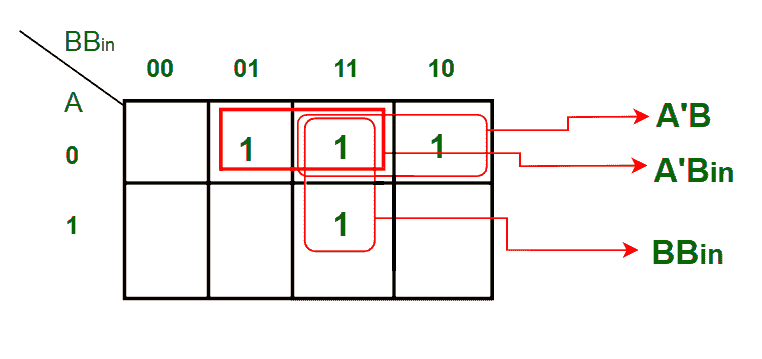

得到的方程是，

```
Bout = BBin + A'B + A'Bin  
```

**全减法器逻辑图:**

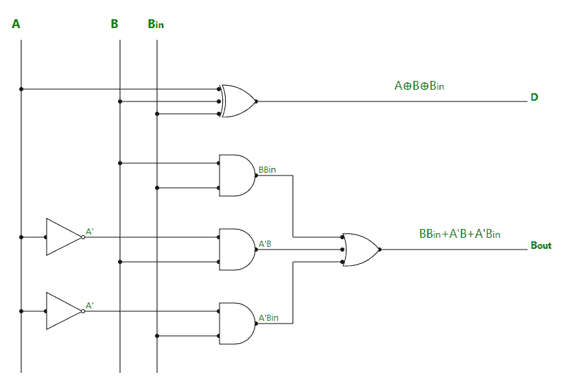

**应用:**

1.  用于在电子计算器和其他数字设备中进行算术计算。
2.  在计时器和程序计数器中。
3.  适用于数字信号处理。