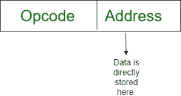
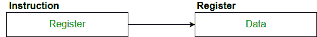
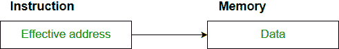

# 寻址模式

> 原文:[https://www.geeksforgeeks.org/addressing-modes/](https://www.geeksforgeeks.org/addressing-modes/)

**寻址模式**–术语寻址模式是指指定指令操作数的方式。寻址模式指定了在实际执行操作数之前解释或修改指令地址字段的规则。

【8086 指令的寻址方式分为两类:

1)数据寻址模式

2)分支寻址模式

8086 内存寻址模式提供灵活的内存访问，允许您轻松访问变量、数组、记录、指针和其他复杂的数据类型。好的汇编语言编程的关键是正确使用内存寻址模式。

汇编语言程序指令由两部分组成

[](https://media.geeksforgeeks.org/wp-content/cdn-uploads/Addressing_Modes_1.jpg) 
操作数的内存地址由两部分组成:

**重要条款**

*   **内存段的起始地址**。
*   **有效地址或偏移量**:偏移量通过添加三个地址元素的任意组合来确定:**位移、基数和索引。**
    *   **位移:**是指令中给出的 8 位或 16 位立即值。
    *   **基础**:基础寄存器的内容，BX 或英国石油。
    *   **索引**:索引寄存器 SI 或 DI 的内容。

根据 8086 微处理器指定操作数的不同方式，8086 采用不同的寻址方式。

8086 微处理器使用的**寻址模式**讨论如下:

*   **隐含模式:**:在隐含寻址中，操作数是在指令本身中指定的。在这种模式下，数据长度为 8 位或 16 位，数据是指令的一部分。零地址指令采用隐含寻址方式设计。
    [](https://media.geeksforgeeks.org/wp-content/cdn-uploads/Addressing_Modes_2.jpg) 

    ```
    Example:  CLC (used to reset Carry flag to 0)
    ```

*   **立即寻址模式(符号#):** 在该模式下，数据出现在指令的地址字段中。设计成一种地址指令格式。
    **注意:**立即模式的限制是常量的范围受地址字段大小的限制。
    

```
Example:  MOV AL, 35H (move the data 35H into AL register)
```

*   **寄存器模式:**在寄存器寻址中，操作数被放置在 8 位或 16 位通用寄存器之一中。数据在指令指定的寄存器中。
    *这里需要一个寄存器引用来访问数据。*
    [](https://media.geeksforgeeks.org/wp-content/cdn-uploads/Addressing_Modes_3.jpg) 

    ```
    Example: MOV AX,CX (move the contents of CX register to AX register)
    ```

    *   **寄存器间接模式**:在这个寻址中，操作数的偏移量被放置在指令中指定的寄存器 BX、BP、SI、DI 中的任何一个中。数据的有效地址在指令指定的基址寄存器或索引寄存器中。
    *这里需要两个寄存器引用才能访问数据。*
    [](https://media.geeksforgeeks.org/wp-content/cdn-uploads/Addressing_Modes_4.jpg)
    8086 CPU 通过寄存器间接寻址模式，让你通过寄存器间接访问内存。

    ```
    MOV AX, [BX](move the contents of memory location s 
    addressed by the register BX to the register AX)
    ```

    *   **Auto Indexed (increment mode)**: Effective address of the operand is the contents of a register specified in the instruction. After accessing the operand, the contents of this register are automatically incremented to point to the next consecutive memory location.**(R1)+**.
    *Here one register reference,one memory reference and one ALU operation is required to access the data.*
    Example:

    ```
    Add R1, (R2)+  // OR
    R1 = R1 +M[R2]
    R2 = R2 + d 
    ```

    *用于循环遍历数组。R2–数组的开始**d*–元素的大小

    *   **Auto indexed ( decrement mode)**: Effective address of the operand is the contents of a register specified in the instruction. Before accessing the operand, the contents of this register are automatically decremented to point to the previous consecutive memory location. *–***(R1)**
    *Here one register reference,one memory reference and one ALU operation is required to access the data.*

    **示例:**

    ```
    Add R1,-(R2)   //OR
    R2 = R2-*d*
    R1 = R1 + M[R2] 
    ```

    *自动减量模式与自动增量模式相同。两者都可以用来实现一个堆栈，如 push 和 pop。自动递增和自动递减模式对于实现“后进先出”数据结构非常有用。*

    *   **Direct addressing/ Absolute addressing Mode (symbol [ ]):** The operand’s offset is given in the instruction as an 8 bit or 16 bit displacement element. In this addressing mode the 16 bit effective address of the data is the part of the instruction.
    *Here only one memory reference operation is required to access the data.*

    [](https://media.geeksforgeeks.org/wp-content/cdn-uploads/Addressing_Modes_5.jpg)

    ```
    Example:ADD AL,[0301]   //add the contents of offset address 0301 to AL
    ```

    *   **Indirect addressing Mode (symbol @ or () )**:In this mode address field of instruction contains the address of effective address.Here two references are required.
    1st reference to get effective address.
    2nd reference to access the data.

    根据有效地址的可用性，间接模式有两种:

    1.  寄存器间接:在这种模式下，有效地址在寄存器中，相应的寄存器名称将保存在指令的地址字段中。
        *这里一个寄存器引用，需要一个内存引用才能访问数据。*
    2.  内存间接:在这种模式下，有效地址在内存中，相应的内存地址将保存在指令的地址字段中。
        *这里需要两个内存引用来访问数据。**   **索引寻址模式**:操作数的偏移量是索引寄存器 SI 或 DI 的内容和 8 位或 16 位位移的总和。

    ```
    Example:MOV AX, [SI +05] 
    ```

    *   **Based Indexed Addressing:** The operand’s offset is sum of the content of a base register BX or BP and an index register SI or DI.

    ```
    Example: ADD AX, [BX+SI] 
    ```

    **基于控制权转移，寻址模式为:**

    *   **PC 相对寻址模式:** PC 相对寻址模式用于实现控制的段内转移，在这种模式下，通过向 PC 添加位移来获得有效地址。

        ```
        EA= PC + Address field value
        PC= PC + Relative value.
        ```

    *   **Base register addressing mode:**Base register addressing mode is used to implement inter segment transfer of control.In this mode effective address is obtained by adding base register value to address field value.

        ```
        EA= Base register + Address field value.
        PC= Base register + Relative value.

        ```

        **注:**

        1.  基于寄存器的 PC 相对 nad 两种寻址模式都适用于运行时的程序重定位。
        2.  基于寄存器的寻址模式最适合写位置无关代码。

    **寻址模式的优势**

    1.  为程序员提供指针、循环控制计数器、数据索引和程序重定位等功能。
    2.  减少指令寻址字段中的位数。

    **取样门问题**

    将左侧给出的每个高级语言语句与右侧列出的最自然的寻址模式进行匹配。

    ```
    1\. A[1] = B[J];         a. Indirect addressing
    2\. while [*A++];        b. Indexed  addressing
    3\. int temp = *x;       c. Autoincrement
    ```

    **(A** ) (1、C)、(2、B)、(3、a)
    **(B)** (1、A)、(2、C)、(3、b)
    **(C)** (1、B)、(2、C)、(3、a)
    **(D)** (1、A)、(2、B)、(3、C)

    **回答:** **(C)**

    **说明:**

    ```
    List 1                           List 2
    1) A[1] = B[J];      b) Index addressing 
    Here indexing is used

    2) while [*A++];     c) auto increment
    The memory locations are automatically incremented

    3) int temp = *x;    a) Indirect addressing
    Here temp is assigned the value of int type stored
    at the address contained in X
    ```

    因此(C)是正确的解决方案。

    本文由 **Pooja Taneja 供稿。**如果发现有不正确的地方，或者想分享更多关于上述话题的信息，请写评论。