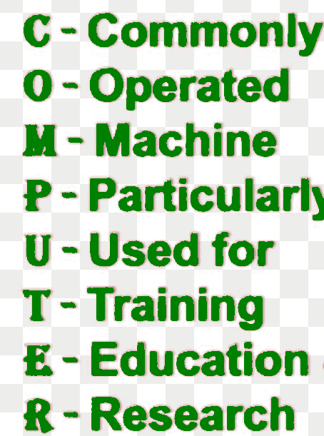

# 电脑的优缺点

> 原文:[https://www . geeksforgeeks . org/计算机的优缺点/](https://www.geeksforgeeks.org/advantages-and-disadvantages-of-computer/)

**计算机**是一个带有一组指令的编程设备，可以执行特定的任务，并以非常高的速度产生结果。计算机是一种机器，与人类相比，它能更快、更准确地解决困难和不同的问题，处理数据，存储&检索数据和进行计算。

计算机的字面意思可能是一种会计算的装置。

然而，现代计算机可以做吨相当计算。计算机可以定义为这样一种机器，它接收输入并存储它，然后根据计算机用户给出的指令处理存储的数据，最后根据需要给出输出。

**来源于词典单词的意思是“计算”。**

*   电子机器
*   将数据作为输入
*   存储数据
*   过程数据
*   生成信息作为输出
*   计算机是一台设计用来处理信息的机器。
*   计算机一词源于拉丁语“computare”，意思是计算或可编程机器。
*   没有程序，计算机什么也做不了。
*   “计算机”一词是指中间处理器单元加上内部存储器。

**电脑优势:**

1.  **多任务处理多任务处理–**
    多任务处理多任务处理是电脑的主要优势之一。人可以同时做多项任务、多项运算，在几秒钟内计算出数值问题。计算机可以在一秒钟内完成数百万或数万亿的工作。
2.  **速度–**
    现在计算机不仅仅是一个计算设备。现在一天的电脑在人类生活中有着至关重要的作用。计算机最大的优点之一是它令人难以置信的速度，这有助于人类在几秒钟内完成任务。
3.  **成本/门店巨大–**
    知识量这是一个咖啡成本解决方案。个人可以在咖啡预算内保存大量数据。存储信息的集中式数据库是降低成本的主要优势。
4.  **精确度–**
    计算机的一个基本优点是它不仅能进行计算，而且能精确地执行。
5.  **数据安全–**
    保护数字数据被理解为数据安全。
6.  **任务完成者–**
    完成人类可能无法完成的任务。
7.  **通信–**
    计算机帮助用户更好地理解和沟通其他设备。
8.  **生产力–**
    生产力水平自动翻倍，因为计算机可以以非常快的速度完成工作。
9.  **减少工作负荷–**
    信息经常被不止一个人访问，需要重复工作。
10.  **可靠性–**
    由于疲劳或无聊，计算机可以重复执行相同的工作，而不会出现错误，这在人类中很常见。
11.  **存储–**
    电脑有一个内置的内存，可以存储大量的知识。您也可以将数据存储在辅助存储设备中。

**电脑的缺点:**

1.  **病毒和黑客攻击–**
    病毒可能是一种蠕虫病毒，黑客攻击只是出于一些非法目的对计算机的未经授权的访问。病毒可以通过电子邮件附件、查看受感染的网站广告、通过 USB 等可移动设备传播到其他系统。
2.  **网络犯罪–**
    网络犯罪是指计算机和网络可能被用于犯罪。网络跟踪和欺诈属于网络犯罪。
3.  **减少就业机会–**
    主要是上一代人不习惯电脑，或者他们需要电脑知识，当电脑进入这个领域时，他们面临着一个巨大的问题。
4.  **高成本–**
    电脑贵。对于南非的普通人来说，即使是最便宜的电脑也仍然非常昂贵。因为电脑赋予了人们力量。
5.  **分心/干扰–**
    如果你曾经花了几个小时在 YouTube 上浏览网页或观看视频，那么你会意识到电脑有多让人分心！因为它们的娱乐价值很高。
6.  **增加浪费，影响环境–**
    随着计算机和其他电子产品被替换的速度，所有被扔掉的旧设备都对环境产生了很大的影响。