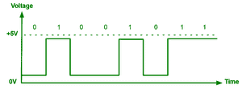

# 数字信号的优缺点

> 原文:[https://www . geeksforgeeks . org/数字信号的优缺点/](https://www.geeksforgeeks.org/advantages-and-disadvantages-of-digital-signals/)

信号是一种电磁或电流，将数据从一个系统或网络传送到一个特殊的系统或网络。电子学中使用的信号主要有两种:模拟信号和数字信号。

**数字信号:**
它只能在一个又硬又快的数值中对抗一个。这种类型的信号代表一个连续值范围内的真实数字。数字信号可以是将数据表示为离散值序列的信号。

*   可变电流或电压。
*   电磁场的相位或极化。
*   声压。
*   磁性存储介质的磁化。
*   数字信号用于所有数字电子设备，包括计算设备和数据传输设备。

下面是数字信号的基本特征。

*   数字信号是连续信号。
*   与模拟信号相比，这种类型的电子 l 信号通常处理和传输得更好。
*   数字信号用途广泛，因此被广泛使用。
*   数字信号的精度优于模拟信号。

**数字信号的优势:**
以下是数字信号的优点/优势。

*   数字数据很容易压缩。
*   使用数字信号的设备更常见，也更便宜。
*   这些信号使移动的仪器没有误差。
*   您可以在不改变第一个副本的情况下编辑声音。
*   数字信号能够以较少的噪声、失真和干扰来传递信息。
*   数字信号可以以相对较低的成本容易地大量再现。
*   由于数字信号处理器的操作经常改变，这就是为什么数字信号处理更灵活。
*   数字信号处理更安全，因为数字信息通常很容易加密和压缩。
*   数字系统更精确，因此通常通过使用检错和纠错码来降低错误发生的概率。
*   使用半导体芯片，数字信号通常很容易存储在任何磁介质或光介质上。
*   数字信号可以远距离传输。

**数字信号的劣势:**

*   采样可能会导致信息丢失。
*   模数和数模需要混合信号硬件。
*   处理器速度有限。
*   产生量化和舍入误差。
*   系统和处理更加复杂。
*   与等效信息的模拟传输相比，数据通信需要更高的带宽。
*   数字系统和处理通常更复杂。