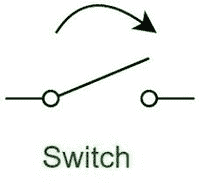

# 开关的优缺点

> 原文:[https://www . geeksforgeeks . org/switch 的优缺点/](https://www.geeksforgeeks.org/advantages-and-disadvantages-of-switch/)

电子**开关**是任何用于干扰电路中电子运动的小装置。开关基本上是成对的小工具:它们要么完全打开(“关闭”)，要么完全关闭(“打开”)。有各种各样的开关，我们将在本节中研究其中的一部分。

尽管在这本书的安排中，在相当晚的阶段涵盖这一基本的电气主题似乎是不正常的，但我这样做的理由是，接下来的章节研究了一个更加成熟的计算机化创新领域，该领域依赖于机械开关触点，而不是强状态入口电路，对开关类型的深入理解对于这一努力非常重要。学习基于开关的电路的能力，同时了解强状态基本原理入口，使这两点更容易处理，并为改善布尔多项式数学的学习体验让路，布尔多项式数学是计算机化基本原理电路背后的科学。

**开关的优势:**

1.  **增加容量–**
    它们增加了组织的可访问数据传输容量。

2.  **减轻负担–**
    它们有助于减轻单个主机电脑的沉重负担。

3.  **增加展示–**
    他们增加了组织的展示。

4.  **套管影响较小–**
    使用交换机的网络套管影响较小。这是因为交换机为每个关联创建影响区域的方式。

5.  **简单–**
    交换机可以直接与工作站相关联。

6.  **增加带宽****—**
    增加网络可用带宽。

7.  **更少的帧冲突–**
    使用交换机的网络将有更少的帧冲突

8.  **更安全–**
    由于交换机是隔离的，数据只会到达目的地。

**开关的缺点:**

1.  **成本高昂–**
    与网络跨度相比，它们的成本更高。

2.  **棘手的可用性问题–**
    网络可用性问题很难通过组织切换来解决。

3.  **交通广播中的问题****—**
    广播交通可能存在问题。

4.  **无防备–**
    如果交换机处于无差别模式，它们对安全攻击毫无防备，例如模仿 IP 地址或捕捉以太网轮廓。

5.  **需要适当的规划****—**
    需要适当的规划和安排来处理多播包裹。

6.  **机械部件会磨损–**
    开关的机械部件会随着时间而磨损。

7.  **物理接触是强制性的–**
    必须与要启动的物体有物理接触。