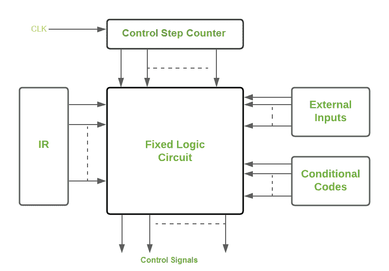

# 硬连线控制单元

的优点&缺点

> 原文:[https://www . geesforgeks . org/优势-劣势-硬连线-控制单元/](https://www.geeksforgeeks.org/advantages-disadvantages-of-hardwired-control-unit/)

在本文中，我们将讨论控制单元及其类型的概述。我们主要关注的是硬连线控制单元的优缺点。下面我们一个一个来讨论。

**控制单元:**
指导处理器操作的单元&是中央处理器的一部分，被称为[控制单元](https://www.geeksforgeeks.org/introduction-of-control-unit-and-its-design/)。它为计算机的操作产生控制信号。

**控制单元的类型:**
控制单元有以下两种类型。

1.  硬连线控制单元
2.  [微编程控制单元](https://www.geeksforgeeks.org/difference-between-hardwired-and-microprogrammed-control-unit/)

我们将在本文中讨论硬连线控制单元。

**硬连线控制单元:**
为了解释指令&为它们产生控制信号，该控制单元使用固定的逻辑电路。为了产生信号，固定逻辑电路使用控制步进计数器、指令寄存器(IR) &代码标志和一些外部输入信号(如中断信号)的内容。下图显示了硬连线控制单元的架构视图，如下所示。

典型硬连线控制单元

图中的固定逻辑电路是由解码器和编码器组成的组合电路。它根据输入的状态生成输出。解码器对载入指令寄存器的指令进行解码，并产生信号作为编码器的输入。此外，外部输入和条件代码充当编码器的输入。编码器然后相应地基于输入产生控制信号。在每条指令执行之后，会产生另一个信号:结束信号，它会重置控制步计数器的状态，并为下一条指令做好准备。

**硬连线控制单元的优势:**
这里，我们将讨论硬连线控制单元的优势如下。

1.  由于使用组合电路产生信号，硬连线控制单元速度很快。
2.  这取决于门的数量，控制信号的产生会有多大的延迟。
3.  它可以被优化以产生快速操作模式。
4.  比微编程控制单元更快。

**硬连线控制单元的缺点:**
这里，我们将讨论硬连线控制单元的缺点如下。

1.  设计的复杂性增加，因为我们需要产生更多的控制信号(需要更多的编码器和解码器)
2.  控制信号的修改非常困难，因为它需要重新安排硬件电路中的线路。
3.  添加一个新特性是困难和复杂的。
4.  难以测试和纠正原始设计中的错误。
5.  它很贵。