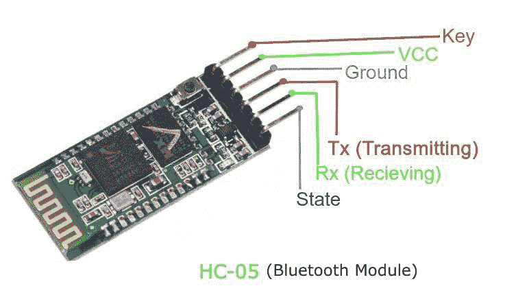

# 关于 HC-05 蓝牙模块的一切|与安卓的连接

> 原文:[https://www . geesforgeks . org/all-about-HC-05-bluetooth-module-connection-with-Android/](https://www.geeksforgeeks.org/all-about-hc-05-bluetooth-module-connection-with-android/)

曾经想用安卓手机控制你的机械机器人，或者用定制遥控器设计机器人，在本教程中，我们将了解用于上述和许多其他情况的蓝牙模块 HC-05。在这里，我们将了解 HC-05 模块的连接和工作，以及它与定制安卓应用程序的接口。
**【基础】**
在电子和通信方面，无线通信正在迅速取代有线连接。HC-05 旨在取代电缆连接，使用串行通信与电子设备通信。通常，它用于连接像手机这样的小设备，使用短程无线连接来交换文件。它使用 2.45GHz 频段。数据传输速率最高可达 1 兆位/秒，范围为 10 米。
HC-05 模块可在 4-6V 电源范围内工作。支持 9600、19200、38400、57600 等波特率。最重要的是，它可以在主从模式下运行，这意味着它既不会发送也不会接收来自外部来源的数据。



HC-05 模块

### 引脚描述

```
Enable - This pin is used to set the Data Mode or and AT command mode (set high).
VCC - This is connected to +5V power supply.
Ground - Connected to ground of powering system.
Tx (Transmitter) - This pin transmits the received data Serially.
Rx (Receiver) - Used for broadcasting data serially over bluetooth.
State -Used to check if the bluetooth is working properly.
```

### 操作模式

HC-05 蓝牙模块可用于两种操作模式:命令模式和数据模式。

#### 命令模式

在命令模式下，您可以通过 AT 命令与蓝牙模块通信，用于配置模块的各种设置和参数，如获取固件信息、更改波特率、更改模块名称，它可以用来将其设置为主模块或从模块。
HC-05 模块的一点是，它可以配置为通信对中的主模块或从模块。为了选择任一模式，您需要激活命令模式并发送适当的 AT 命令。

#### 数据模式

进入数据模式，在该模式下，模块用于与其他蓝牙设备通信，即在该模式下进行数据传输。

## 用微控制器编程 HC-05

代码的技术规格:

*   Arduino-Uno 用作微控制器。

*   名称:HC-05

*   密码:1234(或 0000)

*   类型:从

*   模式:数据

*   波特率:9600，8 个数据位，无奇偶校验，1 个停止位

## C

```
//Define the variable that contains the led
#define ledPin 7
int state = 0;
void setup() {
  //Setting the pin mode and initial LOW
  pinMode(ledPin, OUTPUT);
  digitalWrite(ledPin, LOW);
  Serial.begin(9600); // Default communication rate
}
void loop() {
  // Checks if the data is coming from the serial port
  if(Serial.available() > 0){
    state = Serial.read(); // Read the data from the serial port
 }
 Deciding functions for LED on and off
 if (state == '0') {
  digitalWrite(ledPin, LOW); // Turn LED OFF
  // Send back, to the phone, the String "LED: ON"
  Serial.println("LED: OFF");
  state = 0;
 }
 else if (state == '1') {
  digitalWrite(ledPin, HIGH);
  Serial.println("LED: ON");;
  state = 0;
 }
}
```

## 安卓应用与 HC-05 接口

现在，我们将开发一个小的安卓应用程序来演示蓝牙模块和安卓应用程序的连接。我们将为此目的使用安卓工作室和上面提到的微控制器上的 C 代码。

```
Algorithm:
Create an empty project on Android Studio
Create a ListView containing all the available bluetooth devices. 
Get the name and MAC-address of HC-05 module.
Open connection with HC-05 module.
Instruct the module with data as bytes.
```

### 理解代码

#### 1.获取列表视图中的所有蓝牙设备

该代码用于主活动或第一个活动，其中将显示列表，然后当选择设备时，控制活动将发出命令。

## Java 语言(一种计算机语言，尤用于创建网站)

```
// Initializing the Adapter for bluetooth
private BluetoothAdapter BluetoothAdap = null;
private Set Devices;
// comes in Oncreate method of the activity
BluetoothAdap = BluetoothAdapter.getDefaultAdapter();

// Method to fill the listwith devices
private void pairedDevices()
{
    Devices = BluetoothAdap.getBondedDevices();
    ArrayList list = new ArrayList();

    if (Devices.size() > 0) {
        for (BluetoothDevice bt : Devices) {
            // Add all the available devices to the list
            list.add(bt.getName() + "\n" + bt.getAddress());
        }
    }
    else {
        // In case no device is found
        Toast.makeText(getApplicationContext(), "No Paired Bluetooth Devices Found.", Toast.LENGTH_LONG).show();
    }

    // Adding the devices to the list with ArrayAdapter class
    final ArrayAdapter adapter = new ArrayAdapter(this, android.R.layout.simple_list_item_1, list);
    devicelist.setAdapter(adapter);

    // Method called when the device from the list is clicked
    devicelist.setOnItemClickListener(myListListener);
}
```

#### 2.获取设备的名称和媒体访问控制地址

现在，我们将为列表创建一个 OnClick Listener，以便可以从设备中提取名称和 MAC 地址。

## Java 语言(一种计算机语言，尤用于创建网站)

```
// On click listener for the Listview
private AdapterView.OnItemClickListener myListListener = new AdapterView.OnItemClickListener() {
    public void onItemClick(AdapterView av, View v, int arg2, long arg3)
    {
        // Get the device MAC address
        String name = ((TextView)v).getText().toString();
        String address = info.substring(info.length() - 17);

        // Make an intent to start next activity.
        Intent i = new Intent(MainActivity.this, Control.class);
        // Put the data got from device to the intent
        i.putExtra("add", address); // this will be received at control Activity
        startActivity(i);
    }
};
```

#### 3.在两者之间建立联系

Control.java 的 connect()函数将有助于在两者之间建立连接。

## Java 语言(一种计算机语言，尤用于创建网站)

```
BluetoothAdapter myBluetooth = null;
BluetoothSocket btSocket = null;
// This UUID is unique and fix id for this device
static final UUID myUUID = UUID.fromString("00001101-0000-1000-8000-00805F9B34FB");

// receive the address of the bluetooth device
Intent intent = getIntent();
address = intent.getStringExtra("add");

try {
    if (btSocket == null || !isBtConnected) {
        myBluetooth = BluetoothAdapter.getDefaultAdapter();

        // This will connect the device with address as passed
        BluetoothDevice hc = myBluetooth.getRemoteDevice(address);
        btSocket = hc.createInsecureRfcommSocketToServiceRecord(myUUID);
        BluetoothAdapter.getDefaultAdapter().cancelDiscovery();

        Now you will start the connection
            btSocket.connect();
    }
}
catch (IOException e) {
    e.printStackTrace();
}
```

#### 4.最后命令 HC-05 模块

在这里，首先我们将检查我们的套接字是否连接，然后只有我们将继续避免空指针异常。

## Java 语言(一种计算机语言，尤用于创建网站)

```
// Function for commanding the module
private void turnOffLed()
{
    if (btSocket != null) {
        try { // Converting the string to bytes for transferring
            btSocket.getOutputStream().write("0".toString().getBytes());
        }
        catch (IOException e) {
            e.printStackTrace();
        }
    }
}
```

现在，我们终于用 HC-05 模块和安卓编程完成了我们的第一个基本项目，我们可以继续使用复杂的电子机器人，并使用这个神奇的模块 HC-05 实现有线到无线的连接，我们现在知道如何制作一个定制的应用程序。

#### 你可以在这里找到以上安卓工作室项目提交的[形式的代码。](https://github.com/infoaryan/HC-05-Android-Interfacing)