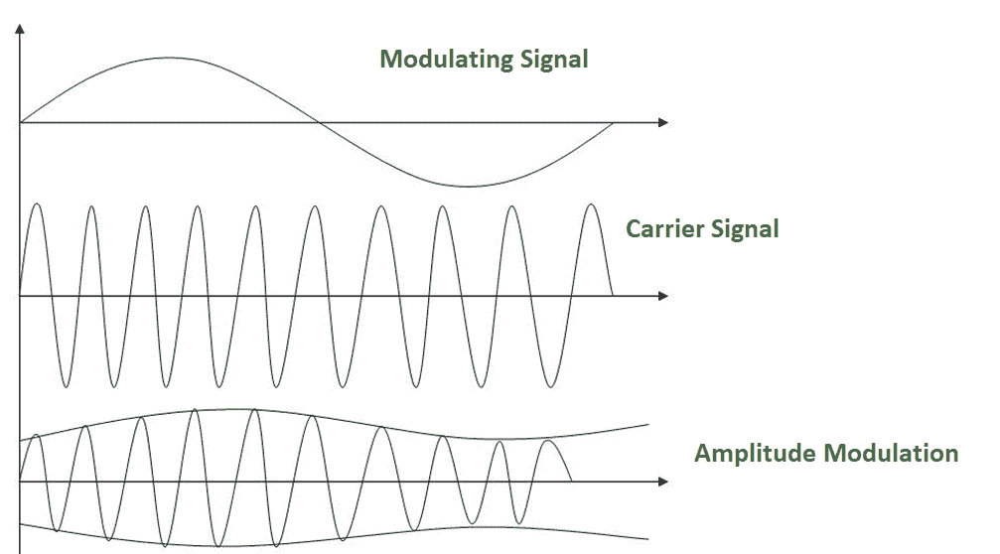
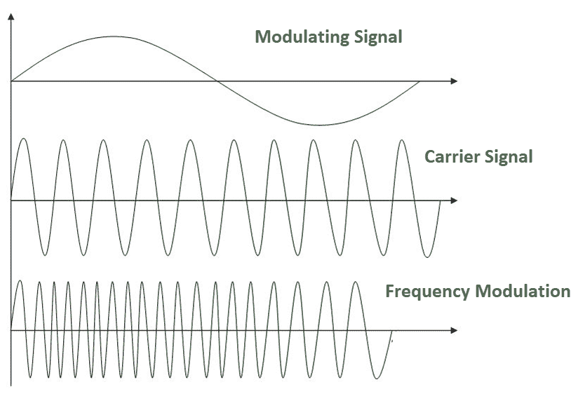
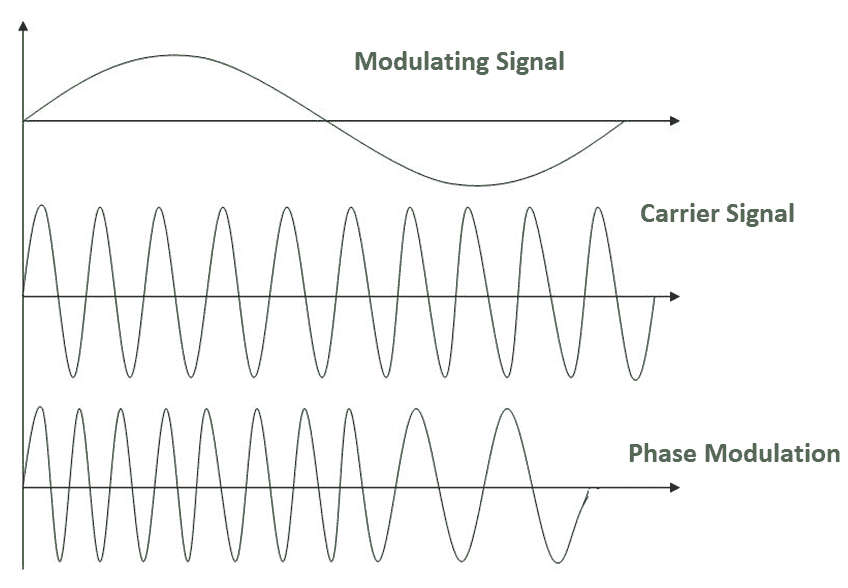

# 模数转换(调制)

> 原文:[https://www . geesforgeks . org/模数转换-调制/](https://www.geeksforgeeks.org/analog-to-analog-conversion-modulation/)

**模拟信号:**模拟信号是任何连续信号，其信号的时变特征是某个其他时变量的表示，即类似于另一个时变信号。

**模数转换–**

模拟-模拟转换，或称调制，是模拟信号对模拟信息的表示。这是一个根据调制信号的瞬时幅度改变载波特性的过程。当需要**带通通道**时，通常需要这种调制。带通是通过带通滤波器传输的一个频率范围，带通滤波器是一种允许特定频率通过的滤波器，防止不需要频率的信号。

模数转换可以通过三种方式完成:

1.  调幅
2.  调频
3.  相位调制

**1。调幅:**

一种调制方式，其中载波的振幅根据调制信号的瞬时振幅而变化，保持相位和频率不变。下图显示了调幅的概念:

调幅通常通过使用简单的乘法器来实现，因为载波信号的幅度需要根据调制信号的幅度来改变。

**AM 带宽:**
调制产生的带宽是调制信号带宽的两倍，覆盖以载波频率为中心的范围。
**带宽= 2fm**

**2。调频–**

载波频率根据调制信号的瞬时振幅而变化的一种调制方式，保持相位和振幅不变。下图显示了频率调制的概念:

调频通常通过使用压控振荡器来实现，就像频移键控一样。振荡器的频率根据输入电压(即调制信号的幅度)而变化。

**调频带宽:**

1.  调频信号的带宽随偏差和调制频率而变化。
    中频调制频率(Mf) 0.5，宽带 Fm 信号。
2.  对于窄带 Fm 信号，所需带宽是调制最大频率的两倍，但是对于宽带 Fm 信号，所需带宽可能要大得多，可检测的边带分布在大量频谱上。

**3。相位调制:**
载波的相位根据调制信号的瞬时振幅而变化的调制，保持振幅和频率不变。下图显示了频率调制的概念:

相位调制实际上类似于频率调制，但是在相位调制中，载波信号的频率没有增加。它通常通过使用压控振荡器和导数来实现。振荡器的频率根据输入电压的导数(即调制信号的幅度)而变化。

**PM 带宽:**

1.  对于小幅度信号，脉冲调制类似于调幅，表现出基带带宽的不幸加倍和低效率。
2.  对于单个大正弦信号，PM 类似于 FM，其带宽近似为， **2 (h+1) Fm** 其中 h=调制指数。

因此，调制允许我们在带通频率范围内发送信号。如果每个信号都有自己的频率范围，那么我们可以在一个通道上同时传输多个信号，所有信号都使用不同的频率范围。