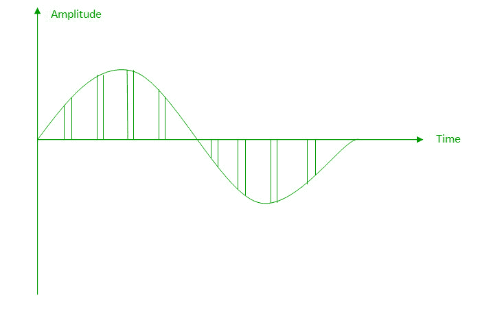
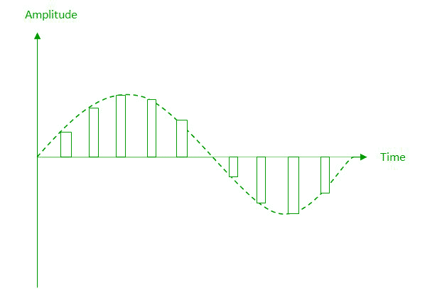
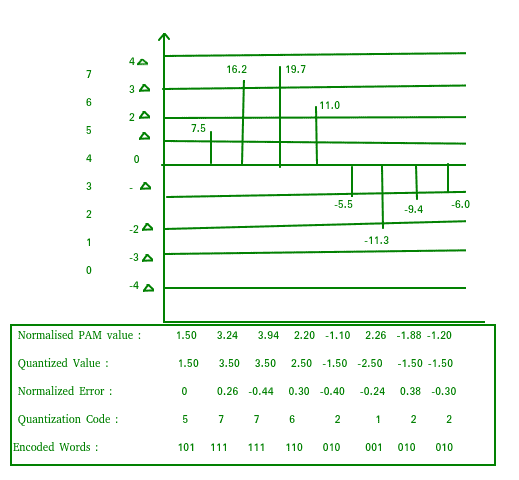
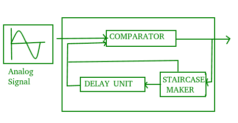
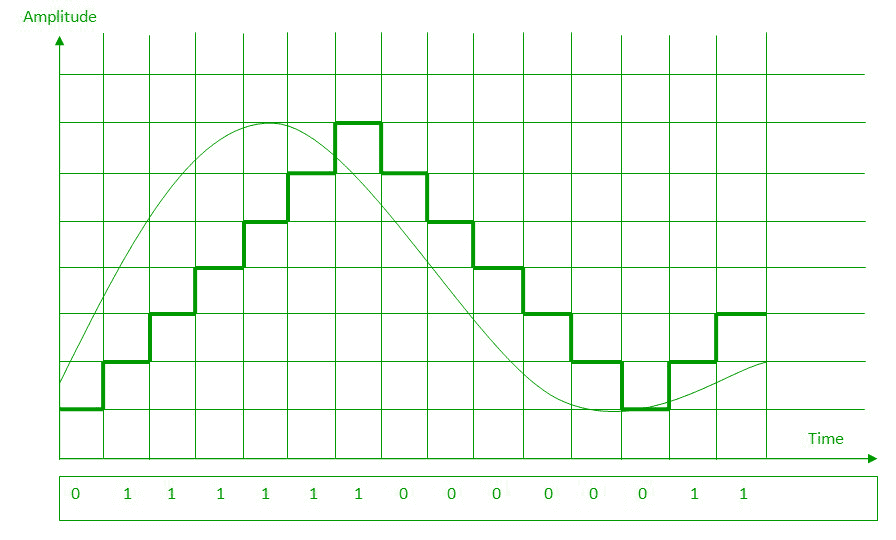
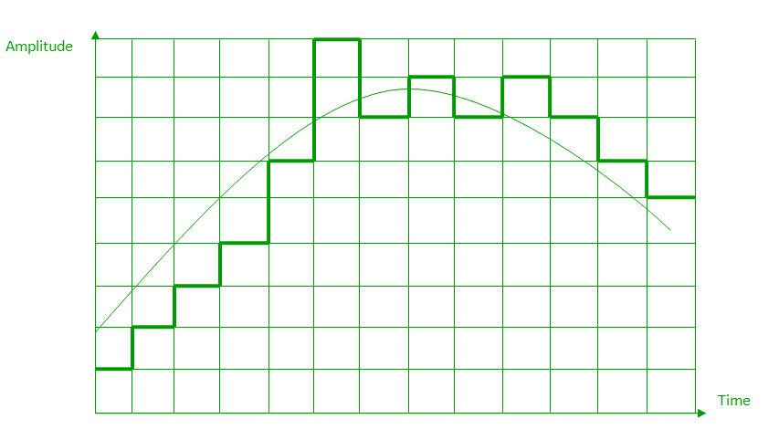

# 模数转换

> 原文:[https://www.geeksforgeeks.org/analog-to-digital-conversion/](https://www.geeksforgeeks.org/analog-to-digital-conversion/)

**数字信号:**数字信号是将数据表示为离散值序列的信号；在任何给定的时间，它只能接受有限数量的值中的一个。

**模拟信号:**模拟信号是任何连续信号，对于该信号，信号的时变特征是某个其他时变量的表示，即类似于另一个时变信号。

以下技术可用于模数转换:

### a.脉冲编码调制:

将模拟信号转换为数字数据的最常见技术称为脉冲编码调制(PCM)。PCM 编码器有以下三个过程:

1.  抽样
2.  量化
3.  编码

**低通滤波器:**
低通滤波器消除输入模拟信号中存在的高频成分，以确保采样器的输入信号没有不需要的频率成分。这样做是为了避免消息信号的混叠。

1.  **Sampling –** The first step in PCM is sampling. Sampling is a process of measuring the amplitude of a continuous-time signal at discrete instants, converting the continuous signal into a discrete signal. There are three sampling methods:

    **(i)理想采样:**在理想采样(也称为瞬时采样)中，来自模拟信号的脉冲被采样。这是一种理想的采样方法，不容易实现。

    **(ii)自然采样:**自然采样是一种实用的采样方法，其中脉冲具有等于 T 的有限宽度。结果是保留模拟信号形状的样本序列。

    

    **(iii)平顶采样:**与自然采样相比，可以轻松获得平顶采样。在这种采样技术中，通过使用电路，样本的顶部保持不变。这是最常用的取样方法。

    

     **奈奎斯特定理:**
    一个重要的考虑因素是采样率或频率。根据奈奎斯特定理，采样率必须至少是信号中包含的最高频率的 2 倍。它也被称为最小采样率，由下式给出:
    Fs =2*fh

2.  **量化–**
    采样的结果是一系列脉冲，其幅度值介于信号的最大幅度和最小幅度之间。振幅集可以是无限的，在两个极限之间有非整数值。

以下是量化的步骤:

1.  我们假设信号的振幅在 Vmax 和 Vmin 之间
2.  We divide it into L zones each of height d where,
    d= (Vmax- Vmin)/ L

    

3.  图表中每个样本顶部的值显示了实际振幅。
4.  归一化脉冲幅度调制(PAM)值使用公式振幅/d 计算。
5.  之后，我们计算量化值，该过程从每个区域的中间选择量化值。
6.  量化误差由量化值和归一化 PAM 值之间的差值给出。
7.  基于图左侧量化级别的每个样本的量化代码。

7.  **编码–**
    模拟信号的数字化由编码器完成。在每个样本被量化并且每个样本的位数被确定之后，每个样本可以被改变为 n 位代码。编码还可以最大限度地减少使用的带宽。

### b.增量调制:

由于 PCM 是一种非常复杂的技术，因此开发了其他技术来降低 PCM 的复杂性。最简单的是增量调制。增量调制发现与前一个值的变化。

**调制器–**调制器在发送端用于从模拟信号产生比特流。这个过程记录了一个小的积极变化，称为增量。如果增量为正，进程记录 1，否则进程记录 0。调制器产生类似楼梯的第二个信号。然后将输入信号与逐渐形成的阶梯信号进行比较。

我们有以下输出规则:

1.  如果输入模拟信号高于阶梯信号的最后一个值，将增量增加 1，数字数据中的位为 1。
2.  If the input analog signal is lower than the last value of the staircase signal, decrease delta by 1, and the bit in the digital data is 0.

    

### c.自适应增量调制:

通过使调制器的步长呈现时变形式，可以显著提高δ调制器的性能。当消息具有陡峭的调制信号斜率时，需要较大的步长，而当消息具有较小的斜率时，需要较小的步长。大小根据输入信号的电平进行调整。这种方法被称为自适应增量调制(ADM)。

