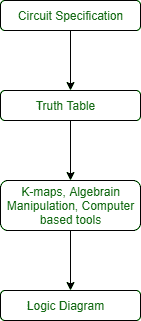

# 组合和时序电路的分析和设计

> 原文:[https://www . geeksforgeeks . org/组合和时序电路的分析和设计/](https://www.geeksforgeeks.org/analysis-and-design-of-combinational-and-sequential-circuits/)

**1。组合电路的分析与[设计](https://www.geeksforgeeks.org/construction-of-combinational-circuits/) :**

为了设计组合电路，该过程包括以下步骤:

1.  找到所需数量的输入和输出，并为每个输入和输出分配一个符号。
2.  根据给定的规格和功能推导真值表。
3.  使用真值表，获得每个输出的简化布尔函数作为输入变量的函数。
4.  画出逻辑电路图。

要从逻辑图中获取输出布尔函数，该过程包括以下步骤:

1.  用独特的符号标记所有门输出。
2.  找出这些门的布尔函数。

为了直接从逻辑图中获得真值表，该过程包括以下步骤:

1.  确定电路中输入变量的数量。
2.  为这些输入绘制表格。n 个输入变量(0 到(2^n -1))有 2^n 组合。
3.  用电路中门的独特符号标记输出。
4.  获取表中这些门的输出。

**组合电路的缺点:**
如果你需要设计一个存储和使用以前的输入和输出的系统，那么我们不能使用组合电路，因为它没有存储任何状态的能力，也不依赖于时钟或时间。对于这些属性，您可以使用时序电路。

**2。[时序电路的分析与设计](https://www.geeksforgeeks.org/introduction-of-sequential-circuits/) :**
要设计时序电路，程序包括以下步骤:

1.  导出状态表和状态方程。
2.  使用状态表导出状态图。
3.  使用状态约简技术约简状态。
4.  验证要使用的触发器数量和类型。
5.  使用激励表推导激励方程。
6.  导出输出函数和触发器输入函数。
7.  导出每个输出变量的逻辑函数或方程。
8.  画出所需的逻辑图。

时序电路的例子有寄存器、[移位寄存器](https://www.geeksforgeeks.org/shift-registers-in-digital-logic/)、[计数器](https://www.geeksforgeeks.org/counters-in-digital-logic/)、[纹波计数器](https://www.geeksforgeeks.org/ripple-counter-in-digital-logic/)、同步计数器等。