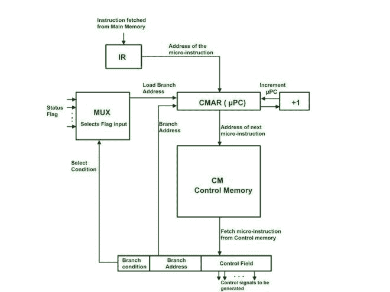

# 微程序控制单元的应用

> 原文:[https://www . geesforgeks . org/applications-of-micro-programled-control-unit/](https://www.geeksforgeeks.org/applications-of-microprogrammed-control-unit/)

**先决条件:** [控制单元及其设计简介](https://www.geeksforgeeks.org/introduction-of-control-unit-and-its-design/)

**微程序控制单元:**
微程序控制单元利用微指令产生控制信号。

**微程序:**

*   程序是一组指令。一条指令需要一组微操作。
*   使用控制信号执行微操作。
*   这里，这些控制信号是使用微指令产生的。
*   这意味着每条指令都需要一组微指令
*   一组微指令被称为微程序。
*   所有指令的微程序都存储在一个叫做控制存储器的小存储器中。
    控制存储器位于处理器内部。

**工作:**
考虑从主存储器提取到指令寄存器(IR)的指令。处理器使用其唯一的操作码来识别第一个微指令的地址。该地址被载入 CMAR(控制存储器地址寄存器)。该地址被解码以决定来自控制存储器的相应存储器指令。微指令只有一个控制字段。控制字段指示要生成的控制信号。大多数微指令都没有地址字段。通常电脑会在每一条微指令后递增。

只要微程序是按顺序执行的。如果只有一个分支微指令，那么就会有一个地址字段。如果分支机构是无条件的，分支机构地址将直接载入 CMAR。对于条件分支，分支条件将检查适当的标志。这是使用一个多路复用器完成的，该多路复用器具有所有标志输入。如果条件为真，则多路复用器将通知 CMAR 加载分支地址。如果条件为假，CMAR 只会增加。
由于控制存储器是非易失性的，因此通常使用闪存来实现。

**微程序控制单元**

**优势:**

1.  主要优势是灵活性。
2.  控制单元的任何改变都可以通过简单地改变微指令来实现。
3.  与硬连线控制单元相比，易于调试。
4.  大多数微指令是按顺序执行的，它们不需要任何地址字段。
5.  减少控制存储器的大小。

**缺点:**

1.  控制存储器必须存在于处理器内部，因此增加了处理器的大小。
2.  这也增加了处理器的成本。

**微程序控制单元的应用:**
微程序具有灵活性、简单性、成本效益等优点。
因此，它在以下应用中具有重大贡献–

1.  **控制单元的发展–**
    现代处理器拥有非常庞大和复杂的指令集。微程序设计用于制造这种处理器的控制单元，因为它远没有那么复杂，而且可以很容易地修改。
2.  **高级语言支持–**
    现代高级语言的数据类型更加高级复杂。微程序设计可以直接从处理器级为这种数据类型提供支持。因此，这种语言变得容易编译，执行起来也更快。
3.  **控制单元的用户定制–**
    由于控制单元是使用软件开发的，因此可以轻松重新编程。这可用于控制单元的定制修改。为此，控制存储器必须是可写的，如随机存取存储器或闪存。
4.  **仿真–**
    仿真是指让一个处理器(比如说 A)仿真另一个处理器(比如说 B)或表现得像另一个处理器。要做到这一点，A 必须能够执行 B 的指令。如果我们对 A 的控制存储器重新编程，与 B 的相同，那么 A 将能够对每条指令模拟 B 的行为。这只有在微程序控制单元中才有可能。
    通常在主处理器必须模拟数学协处理器的行为时使用。
5.  **改进操作系统–**
    微程序可以用来实现操作系统复杂而安全的功能。这不仅使操作系统更加强大和高效，而且更重要的是安全，因为它为操作系统提供了更高程度的保护，免受恶意病毒攻击。
6.  **微诊断或错误调试–**
    由于微程序控制单元是基于软件的，因此与对复杂的硬连线控制单元进行同样的调试相比，调试错误要容易得多。这允许监控、检测和修复控制单元中的任何类型的系统错误。如果相应的硬连线组件出现故障，它也可以用作运行时替代品。
7.  **专用处理器的开发–**
    所有的处理器都不是通用的。许多应用需要专用处理器，如用于通信的 **DSP** (数字信号处理器) [**GPU**](https://www.geeksforgeeks.org/what-is-a-graphics-card/) (图形处理器单元)用于图像处理。
    它们指令集复杂，也需要不断升级。微程序控制单元是他们的最佳选择