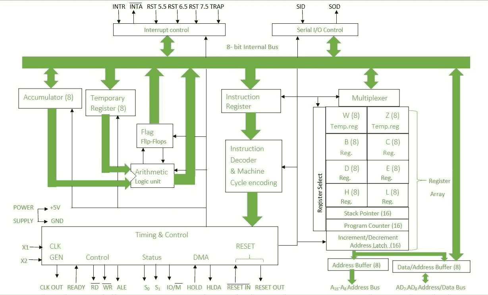

# 8085 微处理器的架构

> 原文:[https://www . geesforgeks . org/architecture-of-8085-微处理器/](https://www.geeksforgeeks.org/architecture-of-8085-microprocessor/)

8085 是一款 8 位通用微处理器。它由以下功能单元组成

1.  **算术逻辑单元(ALU) :**
    用于执行数学运算，如:加、乘、减、除、减、增等。

2.  **标志寄存器:**
    这是一个 8 位寄存器，根据累加器中存储的值存储 0 或 1。

3.  **累加器:**
    累加器用于执行 I/O、算术和逻辑运算。它连接到 ALU 和内部数据总线。

4.  **通用寄存器:**
    共有 6 个通用寄存器。这些寄存器可以保存 8 位值。这些 8 位寄存器是 B、C、D、E、H、l。当它们成对工作时，这些寄存器作为 16 位寄存器工作，如:B-C、D-E、H-l

5.  **程序计数器:**
    程序计数器保存下一条要执行的指令的存储器地址值。它是一个 16 位寄存器。

6.  **堆栈指针:**
    工作方式类似堆栈。在堆栈中，寄存器的内容被存储起来，供以后在程序中使用。它是一个 16 位特殊寄存器。

7.  **临时寄存器:**
    它是一个 8 位寄存器，在算术和逻辑运算期间保存数据值。

8.  **指令寄存器和解码器:**
    它是一个 8 位寄存器，保存正在解码的指令代码。指令从存储器中取出。

9.  **定时和控制单元:**
    定时和控制单元在 CPU 部分之下，它控制数据从 CPU 到其他设备的流动。它还用于控制微处理器和与之相连的设备执行的操作。有一些定时和控制信号，如:控制信号、直接存储器存取信号、复位信号、状态信号。

10.  **中断控制:**
    每当微处理器正在执行主程序时，如果突然发生中断，微处理器将控制从主程序转移到处理传入的请求。请求完成后，控制返回到主程序。8085 微处理器有 5 个中断信号:INTR、TRAP、RST 7.5、RST 6.5、RST 5.5

11.  **地址总线和数据总线:**
    数据总线是双向的，承载要存储的数据。地址总线是单向的，承载着数据存储的位置。
12.  **串行输入/输出控制:**
    利用串行输入数据和串行输出数据控制串行数据通信。