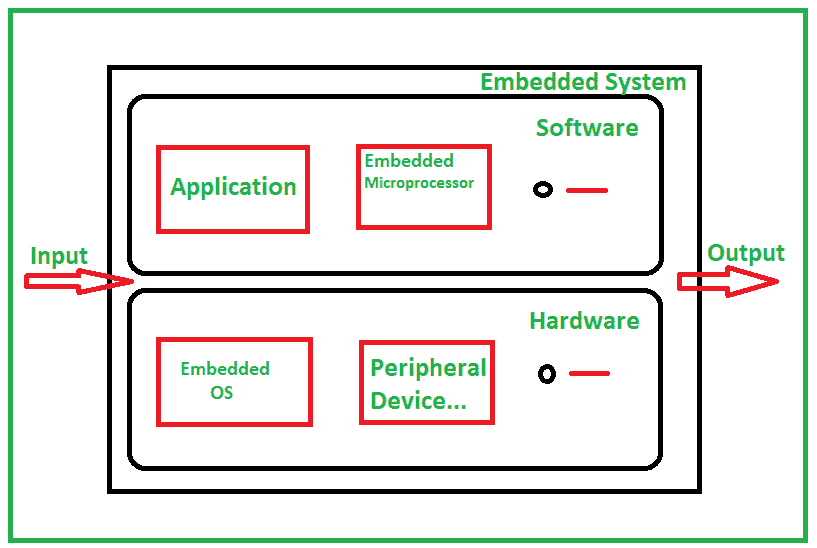

# 嵌入式系统的架构|第 3 集

> 原文:[https://www . geesforgeks . org/嵌入式系统架构集-3/](https://www.geeksforgeeks.org/architecture-of-an-embedded-system-set-3/)

典型的嵌入式系统主要有两部分，即嵌入式硬件和嵌入式软件。

嵌入式硬件基于[微处理器和微控制器](https://www.geeksforgeeks.org/whats-difference-between-microcontoller-%C2%B5c-and-microprocessor-%C2%B5p/)，也包括内存、总线、输入/输出、控制器，其中嵌入式软件包括嵌入式操作系统、不同的应用程序和设备驱动程序。基本上这两种类型的架构，即[哈弗架构](https://www.geeksforgeeks.org/harvard-architecture/)和[冯诺依曼架构](https://www.geeksforgeeks.org/computer-organization-von-neumann-architecture/)用于嵌入式系统。

嵌入式系统的体系结构包括传感器、模数转换器、存储器、处理器、数模转换器和执行器等。

下图展示了嵌入式系统的基本架构概述:



**嵌入式产品开发生命周期(EDLC) :**
开发嵌入式系统或产品主要经历以下三个阶段

```
1. Analysis
2. Design
3. Implementation 
```

如果我们深入一点，它包括这 7 个步骤:

1.  需求分析
2.  考试
3.  设计
4.  发展
5.  试验
6.  部署
7.  维护

现在让我们讨论一下嵌入式系统的一些优点和缺点。

**嵌入式系统优势:**

*   嵌入式系统的性能很快。
*   这些系统耗电更少
*   形状和大小都很小。
*   这些系统是如此的可扩展和可靠。
*   致力于各种行业和环境。
*   提高产品质量，增强性能。
*   执行特定任务时不会出错。

**嵌入式系统的缺点:**

*   嵌入式文件难以备份。
*   有时候发展起来很复杂。
*   整合可能是个问题。
*   提供非常有限的处理资源。
*   故障排除可能很困难。
*   维护可能是个问题。