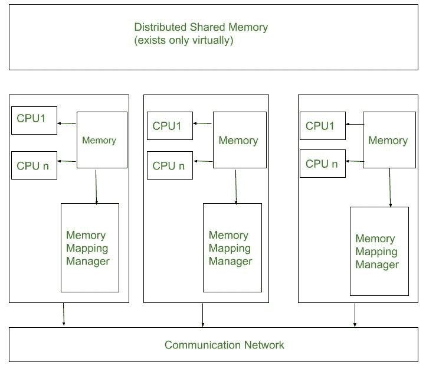

# 分布式共享内存(DSM)架构

> 原文:[https://www . geesforgeks . org/architecture of-distributed-shared-memory DSM/](https://www.geeksforgeeks.org/architecture-of-distributed-shared-memorydsm/)

**分布式共享内存(DSM)** 在没有任何物理共享内存的分布式系统中实现分布式系统共享内存模型。共享模型提供了一个在任意或所有节点之间共享的虚拟地址区域。击败分布式系统中通信的高度伪造。DSM 备忘录，模型提供了一个所有节点共享的虚拟地址区域。系统将信息移动到访问位置。信息在主内存和辅助内存(在一个节点内)之间以及不同节点的主记忆之间移动。

每一个希腊神物都由一个节点控制。初始所有者是创建对象的节点。随着对象从一个节点移动到另一个节点，占有会发生变化。一旦一个方法访问共享地址空间中的信息，映射管理器就将共享内存地址映射到物理内存(本地或远程)。

需求侧管理允许基于不同原因运行的程序共享信息，而软件工程师不必搅动因果消息，相反，底层技术可以发送消息，以保持需求侧管理在计算之间的一致性。需求侧管理允许那些习惯于处理固定笔记本电脑的程序简单地根据不同的原因进行控制。程序访问他们看来是传统的内存。

因此，松树州需求侧管理平方度量的程序有时比使用消息传递的程序更短，更容易掌握。但是，需求侧管理并不适合所有的事情。客户端-服务器系统方形测量通常不太适合需求侧管理，然而，服务器也不习惯于为购买者之间共享的信息提供需求侧管理的实用性。

**分布式共享内存(DSM)的架构:**
每个节点由 1 个或更多的 CPU 和一个内存单元组成。采用高速通信网络连接节点。一个简单的消息传递系统允许完全不同的节点上的进程相互交换。

**内存映射管理器单元:**
每个节点中的内存映射管理器例程将本机内存映射到共享计算机存储上。对于映射操作，共享内存库被分成块。

信息缓存可能是应对操作延迟的一个有据可查的解决方案。DMA 使用信息缓存来缩减网络延迟。单个节点的大部分内存用于缓存共享内存库的项目。

每个节点的内存映射管理器读取其本机内存，作为其相关处理器的共享内存库的巨大缓存。缓存的基本单元可以是内存块。支持需求侧管理的系统，信息在二级存储器和主存储器之间移动，也在不同节点的主记忆之间移动。

**通信网络单元:**
一次方法访问共享地址内的信息房屋映射管理器将共享内存地址映射到物理内存。在操作内核中或作为运行时例程实施的代码映射层。

每个节点上的物理内存都保存着共享虚拟地址库的页面。某个节点内存中的本机页面区域单元礼物。其他节点内存中的远程页面。