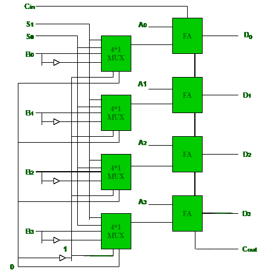

# 运算电路

> 原文:[https://www.geeksforgeeks.org/arithmetic-circuits/](https://www.geeksforgeeks.org/arithmetic-circuits/)

**算术电路**可以使用单个复合电路执行七种不同的算术运算。
它使用全加器(FA)来执行这些操作。多路复用器用于向电路提供不同的输入，以便获得不同的算术运算作为输出。

**4 位算术电路:**
考虑以下具有输入 A 和 b 的 4 位算术电路。它可以通过改变多路复用器的输入和进位来执行七种不同的算术运算(C 0 )。

**上述运算电路的真值表:**

| S 0 | S 1 | C 0 | 多路复用输出 | 全加器输出 |
| --- | --- | --- | --- | --- |
| Zero | Zero | Zero | B | A + B |
| Zero | Zero | one

 | B | A + B + 1 |
| Zero | one | Zero | ' b ' | ' A + B ' |
| Zero | one | one | ' b ' | A+B '+1 = A–B |
| one | Zero | Zero | Zero | A |
| one | Zero | one

 | Zero | A + 1 |
| one | one | Zero | one | a 1 |
| one | one | one | one | A–1+1 = A |

因此，输入 A 和 B 的不同操作是–

1.  A + B(加法器)
2.  A + B + 1
3.  ' A + B '
4.  a–B(减法器)
5.  A
6.  A + 1(增量)
7.  a–1(递减器)