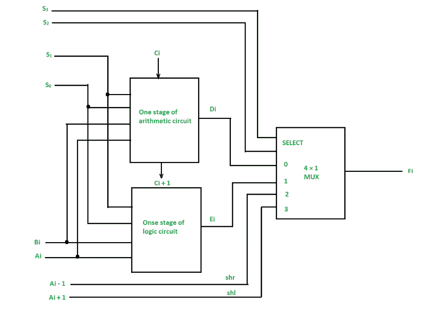
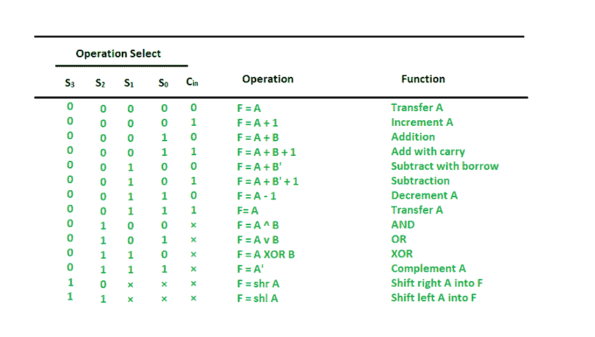

# 计算机体系结构中的算术逻辑移位单元

> 原文:[https://www . geesforgeks . org/算术-逻辑-移位-计算机中的单元-体系结构/](https://www.geeksforgeeks.org/arithmetic-logic-shift-unit-in-computer-architecture/)

**算术逻辑移位单元(ALSU)** 是计算机系统中 [**算术逻辑单元(ALU)**](https://www.geeksforgeeks.org/introduction-of-alu-and-data-path/) 的成员。它是一种执行逻辑、算术和移位运算的数字电路。计算机不是让单独的寄存器直接计算微操作，而是部署许多存储寄存器，这些寄存器连接到一个称为算术逻辑单元(ALU)的公共运算单元。

现在，为了实现微操作，指定寄存器的内容被分配到公共算术逻辑单元的输入端。算术逻辑单元执行一个导致结果并被传送到目的寄存器的操作。算术逻辑单元可以是一个组合电路，以便在一个时钟脉冲量内完成从供应寄存器通过算术逻辑单元到目的寄存器的完整寄存器传输操作。有时，移位微操作在一个单独的单元中执行，但有时它是作为全算术逻辑单元的一部分进行的。

**ALSU 的一级**

我们可以通过添加算术、逻辑和移位电路来组合和制造一个具有公共选择变量的算术逻辑单元。我们可以在下图中看到算术逻辑移位单元的第一级。通过输入 S1 和 S0 选择一些特定的微操作。

输出端的 4×1 多路复用器在 Ei 的相关算术输出和 Hi 的逻辑输出之间进行选择。多路复用器中的数据通过输入和选择，多路复用器的另外两个数据输入获得输入 Ai–1 用于**操作，Ai + 1 用于 ***shl*** 操作。**

****注意:**指定算术级的输出进位 Ci + 1 必须附加到序列中下一级的输入进位 Ci。**

**下图中给出的一级电路提供了 8 个算术运算、4 个逻辑运算和 2 个移位运算，每个运算由 5 个变量 S3、S2、S1、S0 和 Cin 选择。**

**下表显示了算术逻辑单元执行的 14 个操作:**

1.  **前 8 个是算术运算，由 first 选择= 00**
2.  **接下来的 4 个是由 S3·S2 选择的逻辑运算= 01**
3.  **最后两个是移位操作，由 S3·S2 选择= 10 & 11**

**

**ALSU 功能表****