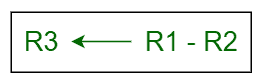
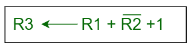
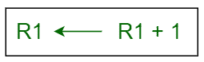
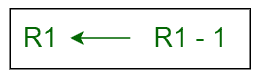
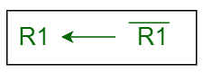
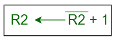

# 寄存器中的算术微操作

> 原文:[https://www . geesforgeks . org/算术-寄存器中的微操作/](https://www.geeksforgeeks.org/arithmetic-micro-operations-in-registers/)

我们可以对存储在寄存器中的数字数据进行算术运算。

**示例:**

```
R3 <- R1 + R2
```

寄存器 R1 中的值与寄存器 R2 中的值相加，然后总和被传送到寄存器 R3。类似地，对寄存器执行其他算术微操作。

*   **加法–**
    此外，在微操作中，寄存器 R1 中的值与寄存器 R2 中的值相加，然后总和被转移到寄存器 R3 中。


*   **减法–**
    在减法微操作中，从寄存器 R1 的内容中减去寄存器 R2 的内容，然后将结果传送到 R3。



做减法还有另一种方法。在这种情况下，将 R2 的 2 的补码加到 R1，相当于**R1–R2**，然后将结果传送到寄存器 R3。



*   **增量–**
    在增量微操作中，R1 寄存器内的值增加 1。



*   **减量–**
    在减量微操作中，R1 寄存器内的值减少 1。



*   **1 的补码–**
    在这个微操作中，取寄存器 R1 内部值的补码。



*   **2 的补码–**
    在这个微操作中，取寄存器 R2 内的值的补码，然后将 1 加到该值上，最后的结果被传送到寄存器 R2。这个过程也叫否定。相当于 **-R2** 。

